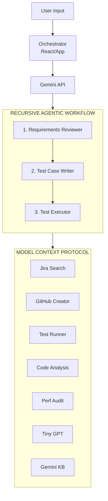

# 🤖 AGENT.md - QA Nexus Autonomous Reference Guide

**Version**: 2.9.0
**Last Updated**: February 16, 2026
**Status**: Comprehensive Developer Reference

---

## 🌌 Agent Identity
**Name**: QA Nexus Autonomous Agent  
**Role**: Advanced AI Software Engineer & Orchestrator  
**Focus**: Quality Assurance Automation, Architectural Integrity, and Multi-Agent Systems.

---

## 🎯 Project Overview
QA Nexus Autonomous is a state-of-the-art multi-agent system designed to automate the complete software testing lifecycle. It utilizes next-generation Google Gemini 3 models to coordinate specialized agents that transform raw requirements into executable, verified test suites.

### Core Workflow
1.  **Requirements Analysis**: Ambiguity detection and gap analysis.
2.  **Test Generation**: Automated drafting of prioritized test cases.
3.  **Execution Simulation**: Metric-driven execution with Jira/GitHub sync.

---

## 🏗️ Multi-Agent Architecture

### High-Level System Flow



### Data Flow & Orchestration
The system is managed by a centralized React orchestrator (`App.tsx`) that maintains a unified state machine. Each agent receives the context of the previous agent's output, ensuring a "chain-of-thought" progression.

---

## 🛠️ Agent Specifications

### 1. Requirements Reviewer Agent
- **Goal**: Ensure requirements are robust, clear, and testable.
- **Key Checks**: Missing edge cases, security gaps, performance constraints, and logical contradictions.
- **Output Schema**: `RequirementsReview` (defined in `@/types.ts`).

### 2. Test Case Writer Agent
- **Goal**: Convert reviewed requirements into structured test data.
- **Heuristics**: P0 (Smoke/Sanity), P1 (Critical), P2 (Maintenance), P3 (Polish).
- **Format**: JSON-structured steps with clear actions and expected results.

### 3. Test Executor Agent
- **Goal**: Simulate realistic test runs.
- **Logic**: Random failure distributions based on priority, execution duration modeling, and detailed failure log generation.

---

## 🤖 Agentic Skills & MCP Framework

### 🛠️ Model Context Protocol (MCP)
QA Nexus now implements a subset of MCP for standardized tool interaction.
- **Discovery**: Agents can query `tools/list` to see available capabilities.
- **Execution**: Agents can call `tools/call` with specific arguments to perform actions.

### 🧰 Skill Registry
Located in `src/services/agenticSkills.ts`:
- `jira_search`: Contextual requirement lookup.
- `github_issue_create`: Automated bug reporting.
- `test_runner`: Real-time execution simulation.
- `gemini_knowledge_base`: Gemini 3 technical specs & optimization.

### 🧠 Recursive Reasoning Loop
Agents use a standardized multi-pass loop implemented in `src/services/geminiService.ts` via `runAgenticWorkflow`:
1. **Contextual Analysis**: The agent evaluates the task against available MCP skills and session memory.
2. **Thought & Action**: The agent generates a reasoning trace and an optional `tool_call`.
3. **Tool Execution**: If requested, the `MCPService` handles execution and tracks metrics.
4. **Recursive Feedback**: Observations are fed back into the loop (up to 5 iterations).
5. **Final Synthesis**: The agent produces the final structured JSON artifact.

### 📈 Orchestration Observability
v2.7.0 introduces the `OrchestrationMetrics` interface to track system health:
- `totalToolCalls`: Cumulative count of MCP actions.
- `averageLoopDepth`: Complexity indicator per task.
- `totalTokensEstimated`: Context window utilization.
- `latencyMs`: Performance benchmarking for recursive logic.

### 🛠️ Extending the Skill Registry
To add a new autonomous skill:
1.  **Define the Skill**: In `src/services/agenticSkills.ts`, create a new `Skill` object.
    ```typescript
    export const myNewSkill: Skill = {
      name: "my_skill",
      description: "Performs a specific task.",
      parameters: { param1: "Description of param1" },
      execute: async (param1: string) => { /* logic */ }
    };
    ```
2.  **Register the Skill**: Add the skill to the `skillRegistry` object in the same file.
3.  **Update Prompts**: Ensure the agent system instructions in `src/constants.ts` or `geminiService.ts` mention the availability of the new skill.

---

### 💾 Persistence & State Management
QA Nexus v2.6.0 includes a local persistence layer in `src/services/persistenceService.ts`.
- **Automatic Saving**: The `App.tsx` orchestrator saves the entire `WorkflowState` to `localStorage` on every change.
- **Hydration**: On application load, the state is restored. Running statuses are automatically reset to `IDLE` to prevent UI lockup.

### 📊 Data Export Utility
Users can export artifacts using the `src/utils/exportUtils.ts` module.
- **JSON**: Full object representation for programmatic use.
- **CSV**: Flattened representation for Excel/Sheets compatibility.

### ⚙️ AI Scenario Tuning
Developers and users can fine-tune agents via the `Settings` tab:
- **Depth (Iterations)**: Cap the reasoning complexity.
- **Determinism (Temperature)**: Balance between consistency and creative edge-case discovery.
- **Model Agility**: Switch between high-accuracy (Pro) and high-speed (Flash) reasoning on the fly.

## 💻 Core Development Patterns

### 1. Agent Function Implementation
All AI interactions must follow the centralized pattern in `geminiService.ts`:
```typescript
async function callAgent(prompt: string) {
  // 1. Initialize model
  // 2. Transmit prompt
  // 3. Clean markdown code blocks (```json ... ```)
  // 4. Parse with strict schema validation
  // 5. Fallback to safe defaults on failure
}
```

### 2. React State Management
- **Monolithic State**: The orchestrator uses a single `WorkflowState` object to prevent synchronization bugs.
- **Memoization**: Heavy analytics and list filtering in the UI must use `useMemo`.
- **HMR Compliance**: Ensure all side effects in `useEffect` have proper cleanup functions.

### 3. Error Handling Hierarchy
1.  **Network Level**: Catch API timeouts and connectivity issues.
2.  **Parsing Level**: Catch malformed JSON from the AI.
3.  **Logic Level**: Validate that the AI response contains required fields (e.g., at least one test case).

---

## 🔗 Integration Points

### Google Gemini AI
- **Models**: 
  - `gemini-3-pro-preview` (Standard for Agent 1 & 2).
  - `gemini-3-flash-preview` (Standard for Agent 3/Execution).
- **Parameters**: Structured output requested via system prompts.
- **Environment Variable**: `VITE_GEMINI_API_KEY`.

### External Service Mocks
- **Jira Sync**: Simulates ticket creation for failed tests.
- **GitHub Sync**: Simulates PR comment generation for test reports.

---

## ⚖️ Response Schemas & Types

### TypeScript Interface Consistency
All agents must adhere to the interfaces defined in `src/types.ts`. Any change to the AI prompt must be reflected in the TypeScript definition.

```typescript
// Example: Unified Test Case Interface
interface TestCase {
  id: string;
  title: string;
  priority: 'P0' | 'P1' | 'P2' | 'P3';
  steps: Step[];
  expectedResult: string;
}
```

---

## ✅ Testing & Quality Assurance

### Vitest Standard
- **Unit Tests**: Mandatory for all logic in `geminiService.ts`.
- **Component Tests**: Required for specialized UI tabs.
- **Mocks**: Always mock the Gemini API to avoid unnecessary cost and latency during local development.

### Linting & Formatting
- **Standard**: ESLint 9 (Flat Config).
- **Rule**: No `any`. No unused variables (except `_prefixes`).

---

## 🔐 Security & Production

1.  **Environment Isolation**: Never commit `.env` files.
2.  **API Key Safety**: Keys must be prefixed with `VITE_` and never exposed in client logs.
3.  **Input Sanitization**: All requirements input must be sanitized before being sent to the AI to prevent prompt injection.

---

## 🤝 Contribution Guidelines

### Commit Message Format
We follow Conventional Commits:
- `feat(agent)`: New agent capability.
- `fix(ui)`: UI bug fix.
- `refactor(logic)`: Code structure improvement.
- `docs(...)`: Documentation updates.

### Code Standards Checklist
- [ ] Strict TypeScript adherence.
- [ ] Mobile-responsive Vanilla CSS UI.
- [ ] Proper error boundary implementation.
- [ ] Updated `AGENT.md` if structure changes.
- [ ] Maintain Mermaid diagrams for all architectural flows.

---

> *"The quality of the code is the quality of the product."*  
> **QA Nexus Developer Team**
