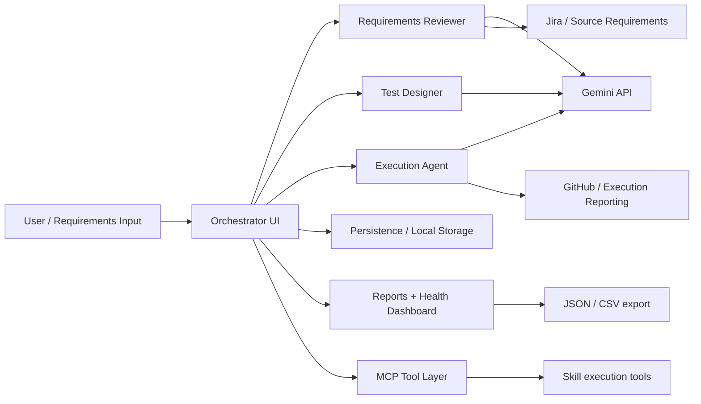

# QA Nexus Autonomous Agent

> Project identity and engineering guidance for the QA Nexus Autonomous repository.

## 1. Purpose

QA Nexus Autonomous is a high-fidelity, multi-agent QA orchestration application built with React, TypeScript, and Google Gemini. It helps teams turn loose requirements into structured specification review, traceable test design, execution analysis, and reporting dashboards.

This repository is designed to be both:
- a usable product for QA workflows, and
- a clear reference implementation for agentic, tool-using AI application patterns.

## 2. Current project state

- Version: 3.3.0
- Node: >= 24.0.0
- Package manager: npm
- Runtime: Vite + React 19 + TypeScript 6
- AI provider: Google Gemini via `@google/genai`
- Test framework: Vitest + Testing Library
- Linting: ESLint 10 flat config

## 3. Architecture overview


```mermaid
flowchart LR
    U[User / Requirements Input] --> O[Orchestrator UI]
    O --> A1[Requirements Reviewer]
    O --> A2[Test Designer]
    O --> A3[Execution Agent]
    A1 --> G[Gemini API]
    A2 --> G
    A3 --> G

    A1 --> J[Jira / Source Requirements]
    A3 --> GH[GitHub / Execution Reporting]
    O --> P[Persistence / Local Storage]
    O --> R[Reports + Health Dashboard]
    R --> E[JSON / CSV export]
    O --> MCP[MCP Tool Layer]
    MCP --> SK[Skill execution tools]
```

### Core responsibilities

- Orchestrator UI: central workflow state and navigation across tabs.
- Requirements Reviewer: ambiguity detection, risk scoring, completeness checks.
- Test Designer: traceable scenarios and acceptance criteria mapping.
- Execution Agent: simulate run outcomes and track test execution status.
- Reports & Health Dashboard: summarize metrics, coverage, latency, tool usage, and system health.
- Persistence layer: session restoration, local state recovery, and application memory.
- MCP / Skills: structured tool execution and reusable AI capabilities.

## 4. Repository layout

```text
.
├── .github/
├── docs/
├── public/
├── skills/
├── src/
│   ├── assets/
│   ├── components/
│   ├── hooks/
│   ├── services/
│   ├── tests/
│   ├── types/
│   ├── utils/
│   ├── App.tsx
│   ├── main.tsx
│   └── ...
├── .env.example
├── AGENT.md
├── CHANGELOG.md
├── CONTRIBUTING.md
├── eslint.config.js
├── index.html
├── LICENSE
├── package.json
├── README.md
├── Skills.MD
├── tsconfig.json
├── tsconfig.node.json
├── vite.config.ts
├── vitest.config.ts
├── package-lock.json
└── .gitignore
```

## 5. Setup and development

### Install

```bash
npm install
```

### Environment variables

Copy the sample environment file before running the app:

```bash
cp .env.example .env
```

Required and optional values:

```dotenv
VITE_GEMINI_API_KEY=your_gemini_api_key_here
VITE_SUPABASE_URL=your_supabase_url_here
VITE_SUPABASE_ANON_KEY=your_supabase_anon_key_here
```

Rules:
- `VITE_GEMINI_API_KEY` is required for AI workflows.
- Supabase values are optional and only needed for persistence features.
- Never commit real secrets.

### Run the app

```bash
npm run dev
```

### Production build

```bash
npm run build
```

### Quality gates

```bash
npm run typecheck
npm run lint
npm test
npm run test:coverage
npm run ci
```

`npm run ci` is the canonical repository validation command and should be used before finalizing changes.

## 6. Key technical patterns

### React + TypeScript

- Use TypeScript strict typing and avoid `any` unless explicitly unavoidable.
- Prefer interfaces/types in `src/types/`.
- Use the `@/` import alias for project-local imports.
- Keep UI components focused and composable.

### Service layer organization

The project is structured around a service-oriented architecture:
- AI orchestration and prompts live in service modules.
- persistence concerns are separated from UI logic.
- tools and integrations are isolated behind small interfaces.
- the orchestrator coordinates state transitions rather than embedding business logic in components.

### Logger and diagnostics

- Prefer the centralized logger over raw `console.*` calls.
- Use debug-level logging sparingly and only where it aids diagnosis.
- Keep warnings and errors actionable and useful to developers.

### Testing expectations

- Add or update tests with functional changes.
- Keep tests close to the feature area under `src/tests/`.
- Prefer Testing Library for UI-level validation.
- Use Vitest for unit and integration coverage.

### UI conventions

- Keep the product in a dark glassmorphism aesthetic unless a change is clearly intentionally different.
- Preserve consistent navigation state across tabs.
- Keep accessibility in mind for focus management and button labeling.

## 7. Functional workflow

The product is meant to follow this lifecycle:

1. Intake a requirement or issue.
2. Validate completeness, ambiguity, risk, and missing edge cases.
3. Generate prioritized test cases with traceability to requirements.
4. Simulate execution outcomes.
5. Aggregate metrics and health indicators.
6. Export or report the results to downstream systems.

This workflow is implemented through the orchestrator and specialized agent stages.

## 8. Agent and product expectations

When working in this repository, treat it as a real product repo, not a toy app.

### Do this

- keep changes consistent with existing architecture
- prefer reuse of existing services and utilities
- maintain TypeScript correctness and lint health
- update documentation when behavior or workflow changes
- add tests for regressions and bug fixes
- use the project version and release notes conventions when shipping changes

### Avoid

- creating new global patterns when the repo already has established ones
- hardcoding Gemini model names where project constants exist
- leaking `.env` secrets into logs or code
- reintroducing deprecated patterns such as raw `console.log` usage
- changing the UI theme or navigation structure without reason
- editing generated or vendor code unless clearly required

## 9. MCP and skill tooling

The repository includes a model-context-protocol style tool layer and a skill registry. These are important for:
- structured tool execution
- agent autonomy and orchestration
- integration with Jira/GitHub and other QA workflow tasks

When modifying tools or skills:
- preserve JSON-RPC semantics and error handling behavior
- ensure the skill contract remains explicit and typed
- handle malformed input defensively
- return informative errors instead of silent failure

## 10. Versioning and release conventions

This repo tracks semantic versioning and keeps release notes in `CHANGELOG.md`.

When making user-facing changes:
- update the version if the change is part of a release
- update `CHANGELOG.md` in the established Keep a Changelog format
- keep the README and AGENT.md synchronized with the current architecture and instructions

## 11. Contribution playbook

### Typical task flow

```bash
git checkout -b feature/my-change
npm install
# make changes
npm run ci
```

### Before submitting

- run `npm run ci`
- confirm tests cover the changed behavior
- ensure docs still match the product state
- verify no secrets are included

## 12. Helpful implementation reminders

- Use `@/` alias imports instead of deep relative paths.
- Prefer small, named functions and typed return values.
- Favor composition over duplication.
- Reuse metadata and constants rather than scattering literals.
- Keep prompts and system instructions explicit and deterministic.
- Maintain a clear separation between UI state, orchestration logic, and external system integration.

## 13. Short operational summary

If another AI agent needs to continue work on this repo, the key starting point is:

1. understand the active tab/workflow in the orchestrator,
2. inspect the service layer that owns the workflow,
3. validate with the repo quality gates,
4. keep the product behavior, docs, and tests aligned.

This repository is a real-world agentic QA system: it should be built and maintained like a product, not like a demo prototype.

## 14. References

- `README.md` — product overview and setup instructions
- `Skills.MD` — skill registry and capability definitions
- `CHANGELOG.md` — release history and current version notes
- `CONTRIBUTING.md` — repository contribution workflow

---

Last updated: October 1, 2026
Version: 3.3.0
