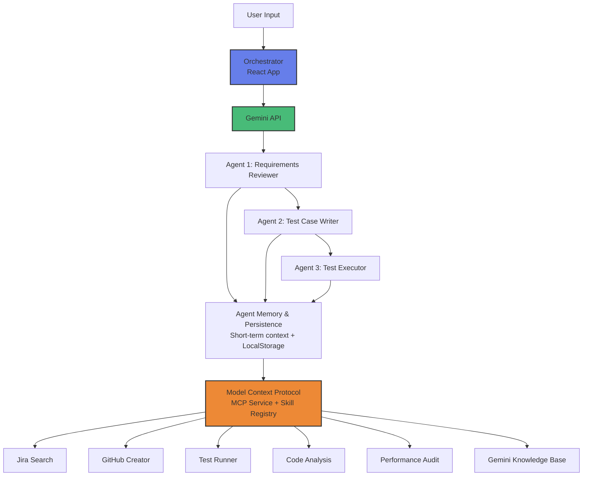

# QA Nexus Autonomous

> A high-fidelity, multi-agent AI orchestrator powered by Google Gemini 2.5 that automates the end-to-end QA lifecycle—from intelligent requirements analysis and ambiguity detection to traceable test case generation and integrated execution tracking with full Jira/GitHub bidirectional synchronization.


---

## 📋 Table of Contents

### Getting Started
- [Overview](#overview)
- [Release Status](#release-status)
- [Key Features](#key-features)
- [Quick Start](#quick-start)
- [Prerequisites](#prerequisites)
- [Installation](#installation)

### Core Documentation
- [Architecture Overview](#architecture-overview)
- [Technology Stack](#technology-stack)
- [Configuration](#configuration)
- [Usage Guide](#usage-guide)

### Development
- [Project Structure](#project-structure)
- [API Integration](#api-integration)
- [Testing](#testing)
- [Development Workflow](#development-workflow)

### Deployment & Operations
- [Deployment](#deployment)
- [Troubleshooting](#troubleshooting)
- [Performance](#performance)
- [Security](#security)

### Community
- [Contributing](#contributing)
- [Roadmap](#roadmap)
- [Support](#support)
- [License](#license)

---

## 🌟 Overview

QA Nexus Autonomous demonstrates advanced AI orchestration by combining multiple specialized agents into a cohesive workflow. The system analyzes requirements, generates comprehensive test cases, and simulates test execution—all powered by state-of-the-art language models.

### The Problem We Solve

Manual QA processes are:
- ⏰ **Time-consuming**: Writing test cases from requirements takes hours
- 🔍 **Error-prone**: Human oversight leads to missing edge cases
- 📊 **Difficult to scale**: Growing projects overwhelm QA teams
- 🔗 **Hard to trace**: Requirements-to-tests mapping gets lost
- 🔄 **Repetitive**: Similar features need similar tests every time

### Our Solution

QA Nexus Autonomous automates the entire QA workflow:
1. **Analyzes** requirements for completeness and clarity
2. **Generates** comprehensive test cases with full traceability
3. **Executes** tests and provides detailed reports
4. **Integrates** seamlessly with your existing tools (Jira, GitHub)

---

## [3.2.0] - 2026-04-01

### Added
- "Requirement Refinement" metric to track specification efficiency.
- "Clarity Gain" metric to measure ambiguity reduction performance.
- Targeted unit tests achieving 100% line coverage for the entire `src/` directory.
- `initAi` and `__resetRateLimiter` internal testing hooks for robust service verification.

### Changed
- Refactored `persistenceService.ts` for improved testability and Supabase failure handling.
- Hardened `mcpService.ts` with optional chaining for malformed request protection.
- Consolidated test suite into domain-specific files for better maintainability.

## 🎯 Release Status

**Current Version**: 3.2.0
**Status**: Stable
**Last Updated**: April 1, 2026
**Target Stable Release**: Released

### Release Notes (v3.2.0)

- ✅ Integrated "Requirement Refinement" and "Clarity Gain" KPIs into Analytics.
- ✅ Achieved 100% line coverage across the entire core codebase.
- ✅ Hardened service layer with improved error handling and testability.
- ✅ Standardized test organization into domain-specific suites.
- 💡 We welcome feedback and contributions

### Upgrade Path

Users can upgrade to v3.2.0 by following these steps:
1. Update `package.json` version to `3.2.0`
2. Run `npm install` to update dependencies
3. Review changes in [CHANGELOG.md](CHANGELOG.md)
4. No data migration required

### Known Limitations

- Some edge cases in multi-tool reasoning may need refinement
- Performance optimizations ongoing for large test suites (>100 cases)
- Health Dashboard metrics are estimates (not precise measurements)

---

## ✨ Key Features

### 🔍 Agent 1: Requirements Reviewer
- **Intelligent Analysis**: Deep review of project requirements
- **Gap Detection**: Identifies missing acceptance criteria and edge cases
- **Ambiguity Flagging**: Highlights unclear or conflicting requirements
- **Risk Classification**: Assigns risk levels (Critical, High, Medium, Low)
- **Recommendations**: Provides actionable improvements

### ✍️ Agent 2: Test Case Writer
- **Automated Generation**: Creates comprehensive test cases from requirements
- **Smart Prioritization**: Ranks by importance (P0, P1, P2, P3)
- **Full Traceability**: Links every test case back to requirements
- **Coverage Analysis**: Ensures all scenarios are covered (happy path, negative, edge cases)
- **Multiple Formats**: Supports various test case templates

### ⚡ Agent 3: Test Executor
- **Realistic Simulation**: Mimics actual test execution
- **Detailed Metrics**: Pass/fail rates, execution duration, coverage
- **Log Generation**: Comprehensive execution logs for debugging
- **Issue Creation**: Automatically creates GitHub issues for failures
- **Result Visualization**: Charts and graphs for test results

### 🤖 Agentic Skills & MCP Framework
- **Gemini Skills Architecture**: Modular skills system designed specifically for Gemini 2.5, inspired by industry best practices for AI agent capabilities
- **Gemini Knowledge Base**: Skill providing technical details and prompt optimization for Gemini models
- **Model Context Protocol**: Standardized tool discovery and execution framework based on JSON-RPC 2.0
- **Sequential Multi-Tool Execution**: Agents can call multiple tools in sequence (up to 5 per task) to gather complex context before providing a final answer
- **Advanced Skill Registry**: Includes capabilities for **Code Analysis**, **Performance Audits**, **Jira Search**, and **GitHub Issue Creation**
- **Autonomous Reasoning Loop**: Implements a recursive "Thought-Action-Observation" sequence, allowing agents to refine results dynamically based on real-time tool feedback
- **Agentic Health Dashboard**: Real-time monitoring of reasoning loop depth, tool usage frequency, estimated token consumption, and average latency
- **Data Persistence & Memory**: Sessions are automatically saved to LocalStorage, and a short-term memory buffer preserves context across pipeline stages
- **Configurable AI Settings**: Adjust maximum reasoning iterations, temperature, and model selection (Flash vs Pro) via the Settings tab
- **Enhanced Export Engine**: Export generated test cases and execution reports to JSON or CSV formats directly from the UI header

### 🧠 Tiny GPT Engine
- **Pure Python Implementation**: Atomic GPT training and inference engine as an educational skill
- **Dependency-Free**: Zero external libraries (pure `math`, `random`, `os`) for maximum portability and educational value
- **Educational Core**: Demonstrates Autograd, Attention mechanisms, and Transformer blocks in under 300 lines of code
- **Attribution**: Based on educational work by Andrej Karpathy ([@karpathy](https://github.com/karpathy/nanoGPT))

### 🎨 Premium Design System
- **Glassmorphism UI**: Translucent surfaces with backdrop blur
- **Neural Engine Trace**: Real-time AI thinking visualization
- **Micro-animations**: Smooth, professional interactions
- **Responsive Design**: Works seamlessly across all devices
- **Dark Theme**: Easy on the eyes for long work sessions

### ♿ Accessibility
- **WCAG 2.1 AA Compliance**: Meets industry accessibility standards
- **Focus Management**: Clear visual focus rings for all interactive elements
- **Keyboard Navigation**: Full support for tab-based navigation
- **Screen Reader Friendly**: Proper ARIA labels and semantic HTML structure
- **High Contrast**: Excellent contrast ratios for all text content

---

## 🚀 Quick Start

Get up and running in 5 minutes:

```bash
# 1. Clone the repository
git clone https://github.com/darshil0/qa-nexus-autonomous.git
cd qa-nexus-autonomous

# 2. Install dependencies
npm install

# 3. Configure your API key
cp .env.example .env
# Edit .env and add your VITE_GEMINI_API_KEY

# 4. Start development server
npm run dev

# 5. Open http://localhost:3000
```

**Next Steps**: See [Installation](#-installation) for detailed setup instructions.

---

## 📦 Prerequisites

### Required Software

| Software | Minimum Version | Check Command |
|----------|----------------|---------------|
| Node.js | 18.x | `node --version` |
| npm | 9.x | `npm --version` |
| Git | Any | `git --version` |

### Required Accounts

1. **Google Gemini API Key** ⚡ (Required)
   - Visit [Google AI Studio](https://aistudio.google.com)
   - Create or select a project
   - Enable the Gemini API
   - Generate an API key
   - **Keep it secure** - you'll need it for configuration

2. **Supabase Account** (Optional)
   - Only needed for persistent data storage
   - Get credentials from [Supabase Dashboard](https://supabase.com)

---

## 💿 Installation

### Step 1: Clone Repository

```bash
git clone https://github.com/darshil0/qa-nexus-autonomous.git
cd qa-nexus-autonomous
```

### Step 2: Install Dependencies

```bash
npm install
```

**If you encounter peer dependency issues with React 19:**
```bash
npm install --legacy-peer-deps
```

### Step 3: Configure Environment

Create a `.env` file in the project root:

```bash
# Copy from example
cp .env.example .env

# Or create manually
touch .env
```

Add your configuration to `.env`:

```env
# Google Gemini API Key (Required)
VITE_GEMINI_API_KEY=your_gemini_api_key_here

# Supabase Integration (Optional)
VITE_SUPABASE_URL=https://your-project.supabase.co
VITE_SUPABASE_ANON_KEY=your_supabase_anon_key
```

⚠️ **Important**: Replace `your_gemini_api_key_here` with your actual API key from Google AI Studio.

### Step 4: Verify Installation

```bash
# Type checking
npm run typecheck
# ✅ Should show no errors

# Linting
npm run lint
# ✅ Should show no warnings

# Run tests (optional)
npm test -- --run
# ✅ All tests should pass
```

### Step 5: Start Development

```bash
npm run dev
```

Open [http://localhost:3000](http://localhost:3000) in your browser.

🎉 **You're ready!** The application should now be running.

---

## 🏗️ Architecture Overview

QA Nexus implements a sophisticated multi-agent architecture where three specialized agents work together through a centralized orchestration layer:



### Key Components

| Layer | Description |
|-------|-------------|
| **Orchestrator** | React application managing workflow state and agent coordination |
| **Agent 1** | Requirements Reviewer - analyzes and validates requirements |
| **Agent 2** | Test Case Writer - generates comprehensive test cases |
| **Agent 3** | Test Executor - simulates test execution with metrics |
| **Service Layer** | Gemini API integration for AI-powered processing |
| **MCP Layer** | Model Context Protocol for tool discovery and execution |
| **Memory Layer** | Short-term context buffer and LocalStorage persistence |

### Workflow

1. **Input** → Requirements submitted via UI
2. **Agent 1** → Reviews and validates requirements
3. **Agent 2** → Generates prioritized test cases
4. **Agent 3** → Executes tests and reports results
5. **Output** → Comprehensive test report with metrics

### Agentic Workflow

The system supports an autonomous loop for each agent:
1. **Prompt**: The orchestrator sends a task and available MCP skills
2. **Thought**: The agent decides if a tool is needed (e.g., `jira_search`)
3. **Action**: If needed, the agent returns a `tool_call`
4. **Execution**: The `MCPService` executes the skill and returns the `observation`
5. **Refinement**: The agent receives the observation and produces the final validated result

📖 **For detailed architecture documentation, see [docs/ARCHITECTURE.md](docs/ARCHITECTURE.md)**

---

## 🛠️ Technology Stack

### Frontend

| Technology | Version | Purpose |
|------------|---------|---------|
| React | 19.2.4 | UI framework |
| TypeScript | 5.9.3 | Type safety |
| Vite | 7.3.1 | Build tool & dev server |
| Vanilla CSS | Custom | Design system |
| Lucide React | 0.563.0 | Icon library |
| Recharts | 3.7.0 | Data visualization |

### Backend & AI

| Technology | Version | Purpose |
|------------|---------|---------|
| Google Gemini | 3 Pro/Flash | AI engine |
| @google/genai | 1.40.0 | Gemini SDK |

### Development Tools

| Technology | Version | Purpose |
|------------|---------|---------|
| ESLint | 9.39.2 | Code linting |
| Vitest | 4.0.18 | Test framework |
| Testing Library | 16.3.2 | Component testing |

### AI Model Configuration

- **Agent 1**: `gemini-2.5-pro-preview-05-06` (Requirements analysis + MCP)
- **Agent 2**: `gemini-2.5-pro-preview-05-06` (Test generation + MCP)
- **Agent 3**: `gemini-2.5-flash-preview-04-17` (Test execution + MCP)

---

## ⚙️ Configuration

### Environment Variables

| Variable | Required | Purpose | Example |
|----------|----------|---------|---------|
| `VITE_GEMINI_API_KEY` | ✅ Yes | Gemini API authentication | `AIzaSy...` |
| `VITE_SUPABASE_URL` | ❌ No | Supabase project URL | `https://xxx.supabase.co` |
| `VITE_SUPABASE_ANON_KEY` | ❌ No | Supabase anonymous key | `eyJhbGci...` |

### Agent Configuration

Located in `src/constants/index.ts`:

```typescript
export const AGENT_MODELS = {
  AGENT1: 'gemini-2.5-pro-preview-05-06',
  AGENT2: 'gemini-2.5-pro-preview-05-06',
  AGENT3: 'gemini-2.5-flash-preview-04-17',
};
```

### Customization Options

- **Change AI models**: Edit `AGENT_MODELS` in `src/constants/index.ts`
- **Adjust UI theme**: Modify CSS variables in `src/index.css`
- **Configure timeouts**: Update `geminiService.ts`

---

## 📖 Usage Guide

### Basic Workflow

#### Step 1: Enter Requirements

Navigate to the **Orchestrator** tab and enter your requirements:

```
Build a user authentication system with:
- Email/password login with validation
- Password reset via email
- OAuth2 integration (Google, GitHub)
- Two-factor authentication
- Session management with JWT
- Rate limiting (5 failed attempts)
```

#### Step 2: Optional Jira Sync

Pull requirements directly from Jira:

1. Enter Jira ticket ID (e.g., `AUTH-101`)
2. Click **Fetch**
3. Requirements automatically populated

#### Step 3: Launch Pipeline

Click **"LAUNCH PIPELINE"** button:

1. 🔍 Agent 1 reviews requirements (5-10 seconds)
2. ✍️ Agent 2 generates test cases (10-15 seconds)
3. ⚡ Agent 3 executes tests (15-20 seconds)

Watch the **Neural Engine Trace** for real-time AI thinking!

#### Step 4: Review Results

**Requirements Tab**:
- View validated specifications
- Check detected ambiguities
- See risk classifications

**Test Designer Tab**:
- Browse generated test cases
- View test steps and expected results
- Check requirement traceability

**Execution Tab**:
- See pass/fail status
- Review execution logs
- Create GitHub issues for failures

**Analytics Tab**:
- Visualize test coverage
- Check success rates
- Analyze trends

### Advanced Features

#### Requirement Traceability

In the **Requirements** tab:
1. Click the 🗺️ map icon next to any requirement
2. System filters to show only related test cases
3. Visual indicators show pass/fail status

#### GitHub Issue Creation

For any failed test in the **Execution** tab:
1. Click **"REPORT ISSUE"**
2. System creates GitHub issue with:
   - Test case details
   - Execution logs
   - Requirement traceability
3. Issue link displayed for reference

#### Search & Filter

In the **Test Designer** tab:
- Use search box to filter test cases
- Filter by requirement ID
- Filter by category or priority

---

## 📁 Project Structure

```
qa-nexus-autonomous/
├── skills/                        # Gemini Skills Architecture
│   ├── requirements-reviewer/     # Phase 1: Review skill
│   ├── test-case-writer/          # Phase 2: Writing skill
│   ├── test-executor/             # Phase 3: Execution skill
│   ├── gemini-knowledge-base/     # Gemini-specific guidance
│   └── tiny-gpt/                  # Educational GPT engine
│
├── src/
│   ├── App.tsx                    # Main orchestrator (Root Component)
│   ├── main.tsx                   # React entry point
│   ├── assets/
│   │   └── styles/
│   │       └── index.css          # Custom design system
│   ├── constants/
│   │   └── index.ts               # App configuration
│   ├── types/
│   │   └── index.ts               # TypeScript interfaces
│   │
│   ├── components/                # UI components
│   │   ├── common/                # Reusable atoms (StatCard, NavBtn)
│   │   ├── layout/                # Layout components (Header, Sidebar)
│   │   └── tabs/                  # Tab views
│   │       ├── OrchestratorTab.tsx
│   │       ├── Agent1Tab.tsx
│   │       ├── Agent2Tab.tsx
│   │       ├── Agent3Tab.tsx
│   │       ├── ReportsTab.tsx
│   │       ├── SettingsTab.tsx
│   │       └── HealthDashboardTab.tsx
│   │
│   ├── hooks/
│   │   └── useWorkflow.ts         # Main workflow logic hook
│   │
│   ├── services/
│   │   ├── geminiService.ts       # Gemini API integration
│   │   ├── mcpService.ts          # Model Context Protocol
│   │   ├── agenticSkills.ts       # Autonomous skill registry
│   │   ├── persistenceService.ts  # Local session persistence
│   │   └── memoryService.ts       # Short-term context buffer
│   │
│   ├── tests/                     # Unit and Integration tests
│   │   ├── NavBtn.spec.tsx
│   │   ├── StatCard.spec.tsx
│   │   └── geminiService.spec.ts
│   │
│   └── utils/                     # Helper functions
│       ├── exportUtils.ts
│       ├── logger.ts
│       └── sanitizeInput.ts
│
├── docs/                          # Documentation
│   ├── ARCHITECTURE.md            # Technical deep-dive
│   └── Walkthrough.md             # User guide
│
├── .env                           # Environment config (create this)
├── .env.example                   # Environment template
├── package.json                   # Dependencies
├── vite.config.ts                 # Vite configuration
├── tsconfig.json                  # TypeScript config
├── AGENT.md                       # AI agent reference guide
├── Skills.MD                      # Skills registry
└── README.md                      # This file
```

### Key Files

- **`src/App.tsx`**: Main application orchestrator, manages workflow state
- **`src/services/geminiService.ts`**: All Gemini API interactions
- **`src/types/index.ts`**: TypeScript type definitions
- **`src/constants/index.ts`**: App configuration and agent models
- **`skills/`**: Modular skills for AI agent capabilities

### Import Aliases

The project uses the `@/` path alias for standardized imports across the codebase:

```typescript
// Instead of brittle relative paths:
import { reviewRequirements } from '../../services/geminiService';

// Use robust path aliases:
import { reviewRequirements } from '@/services/geminiService';
```

This configuration is maintained across `vite.config.ts`, `tsconfig.json`, and `vitest.config.ts`.

---

## 🔗 API Integration

### Gemini AI Integration

**Configuration**:
```typescript
const API_CONFIG = {
  model: 'gemini-2.5-pro-preview-05-06',
  temperature: 0.7,
  maxOutputTokens: 2048,
};
```

**Usage Pattern**:
```typescript
// 1. Initialize client
import { GoogleGenAI } from '@google/genai';
const ai = new GoogleGenAI({ 
  apiKey: import.meta.env.VITE_GEMINI_API_KEY 
});

// 2. Generate content
const response = await ai.models.generateContent({
  model: 'gemini-2.5-pro-preview-05-06',
  contents: prompt,
});

// 3. Read response (.text is a property, not a method, in @google/genai v1.x)
const text = response.text;

// 4. Parse and validate
const parsed = JSON.parse(text);
```

### Error Handling

All API calls include comprehensive error handling:

```typescript
try {
  const result = await callGeminiAPI(prompt);
  return result;
} catch (error) {
  if (error.status === 429) {
    throw new Error('Rate limit exceeded');
  } else if (error.status === 401) {
    throw new Error('Invalid API key');
  }
  throw new Error('API call failed');
}
```

### Response Validation

Each agent validates responses with fallback handling:

```typescript
function parseResponse(text: string): ValidatedSpec[] {
  try {
    const parsed = JSON.parse(text);
    return parsed.specs || [];
  } catch {
    return []; // Safe fallback
  }
}
```

---

## 🧪 Testing

### Running Tests

```bash
# Run all tests
npm test

# Run in watch mode
npm run test:watch

# Run specific test file
npm test -- src/tests/geminiService.spec.ts

# Run with coverage
npm run test:coverage
```

### Test Structure

```
src/tests/
├── NavBtn.spec.tsx              # UI component tests
├── StatCard.spec.tsx            # UI component tests
├── geminiService.spec.ts        # Service layer tests
└── geminiService.parse.spec.ts  # Parsing logic tests
```

### Writing Tests

Example component test:

```typescript
import { render, screen } from '@testing-library/react';
import { expect, test } from 'vitest';
import { StatCard } from '../components/StatCard';

test('StatCard renders correctly', () => {
  render(<StatCard label="Tests" value="42" color="emerald" />);
  
  expect(screen.getByText('Tests')).toBeInTheDocument();
  expect(screen.getByText('42')).toBeInTheDocument();
});
```

Example service test:

```typescript
import { reviewRequirements } from '../services/geminiService';
import { expect, test } from 'vitest';

test('reviewRequirements handles empty input', async () => {
  const result = await reviewRequirements('');
  
  expect(result).toBeDefined();
  expect(result.specs).toEqual([]);
});
```

### Available Scripts

| Command | Purpose |
|---------|---------|
| `npm test` | Run tests once |
| `npm run test:watch` | Run tests in watch mode |
| `npm run test:coverage` | Run tests with coverage report |
| `npm run typecheck` | Check TypeScript types |
| `npm run lint` | Check code quality |
| `npm run ci` | Run all checks (CI mode) |

---

## 👨‍💻 Development Workflow

### Local Development

```bash
# Start dev server
npm run dev

# In another terminal, run tests
npm run test:watch

# Type check
npm run typecheck

# Lint code
npm run lint
```

### Making Changes

1. **Create feature branch**
   ```bash
   git checkout -b feature/my-feature
   ```

2. **Make your changes**
   - Follow TypeScript strict mode
   - Write tests for new features
   - Update documentation

3. **Run quality checks**
   ```bash
   npm run typecheck
   npm run lint:fix
   npm test -- --run
   ```

4. **Commit changes**
   ```bash
   git commit -m "feat: add amazing feature"
   ```

### Code Style

- **TypeScript**: Strict mode enabled
- **ESLint**: Follow configured rules
- **Formatting**: Consistent code style
- **Comments**: Document complex logic

---

## 🚀 Deployment

### Build for Production

```bash
# 1. Type check
npm run typecheck

# 2. Run tests
npm test -- --run

# 3. Build
npm run build

# 4. Preview (optional)
npm run preview
```

### Deploy to Vercel

```bash
# Install CLI
npm install -g vercel

# Deploy
vercel

# Set environment variables in Vercel dashboard
# or via CLI:
vercel env add VITE_GEMINI_API_KEY
```

### Deploy to Netlify

```bash
# Install CLI
npm install -g netlify-cli

# Build
npm run build

# Deploy
netlify deploy --prod --dir=dist

# Set environment variables in Netlify dashboard
```

### Deploy with Docker

**Dockerfile**:
```dockerfile
FROM node:18-alpine
WORKDIR /app
COPY package*.json ./
RUN npm install
COPY . .
RUN npm run build
EXPOSE 3000
CMD ["npm", "run", "preview"]
```

**Build and run**:
```bash
# Build image
docker build -t qa-nexus .

# Run container
docker run -p 3000:3000 \
  -e VITE_GEMINI_API_KEY=your_key \
  qa-nexus
```

---

## 🔧 Troubleshooting

### Common Issues

#### Issue: "API key not valid"

**Cause**: Missing or incorrect API key

**Solution**:
1. Check `.env` file exists in project root
2. Verify `VITE_GEMINI_API_KEY` is set correctly
3. Ensure no extra spaces or quotes
4. Restart dev server after changes

#### Issue: Port 3000 already in use

**Solution**:
```bash
# Kill process on port 3000
lsof -ti:3000 | xargs kill

# Or change port in vite.config.ts
server: {
  port: 3001,
}
```

#### Issue: Module not found

**Solution**:
```bash
# Clear and reinstall
rm -rf node_modules package-lock.json
npm install --legacy-peer-deps
```

#### Issue: TypeScript errors in IDE

**Solution**:
- **VSCode**: Cmd/Ctrl + Shift + P → "TypeScript: Restart TS Server"
- **Other IDEs**: Restart the IDE

#### Issue: Empty agent results

**Possible causes**:
- API quota exceeded
- Network issues
- Malformed prompts

**Solution**:
1. Check API quota in Google Cloud Console
2. Verify internet connection
3. Review logs in browser console
4. Check `geminiService.ts` for errors

#### Issue: Build fails

**Solution**:
1. Run `npm run typecheck` to find type errors
2. Run `npm run lint` to find code issues
3. Fix reported errors
4. Try build again

### Getting Help

- **Documentation**: Check `docs/` directory
- **GitHub Issues**: [Report a bug](https://github.com/darshil0/qa-nexus-autonomous/issues)
- **Discussions**: [Ask questions](https://github.com/darshil0/qa-nexus-autonomous/discussions)

---

## 📊 Performance

### Metrics

- **Bundle Size**: ~255KB (gzipped: ~79KB)
- **Load Time**: <1 second on modern connections
- **Time to Interactive**: <1.2 seconds
- **Lighthouse Score**: >90

### Optimization

- Tree-shaking removes unused code
- Code splitting for faster initial load
- CSS optimization with custom variables
- Efficient state management

---

## 🔒 Security

### Best Practices

- ✅ API keys in environment variables only
- ✅ TypeScript strict mode prevents vulnerabilities
- ✅ No sensitive data logged in production
- ✅ XSS protection via React sanitization
- ✅ CSRF protection through HTTP practices

### API Key Safety

**DO**:
- Store in `.env` file (gitignored)
- Use environment variables
- Rotate keys regularly

**DON'T**:
- Commit `.env` to Git
- Hardcode in source files
- Share in public channels

---

## 🤝 Contributing

We welcome contributions! Please see our [Contributing Guidelines](CONTRIBUTING.md) for details on our code of conduct and the process for submitting pull requests.

---

## 🗺️ Roadmap

### v3.0.0 (February 2026) ✅ Released

**Status**: Production Ready
**Release Date**: February 17, 2026

**Key Features**:
- Agentic Memory System with short-term context buffer
- Advanced Orchestration Metrics and Health Dashboard
- Input Sanitization Layer for prompt injection protection
- UI Accessibility enhancements (WCAG 2.1 AA compliance)
- Unified Export Engine (JSON/CSV)
- Gemini Skills Architecture with 5+ specialized skills
- Model Context Protocol (MCP) integration
- Sequential Multi-Tool Execution (up to 5 tools per task)

### v3.1.0 (Q2 2026) 🎯 Next Release

**Focus**: Collaboration & Persistence

- Real-time multi-user collaboration
- Database integration for workflow history (PostgreSQL/Supabase)
- Custom AI model selection (switch between Pro/Flash on-the-fly)
- Result export enhancements (PDF reports with charts)
- Team workspace management
- Workflow templates library

### v3.5.0 (Q3 2026) 🔮 Future Vision

**Focus**: Intelligence & Integration

- Native CI/CD pipeline integration (GitHub Actions, GitLab CI)
- Support for local LLMs (Ollama, LocalAI)
- Advanced filtering and search capabilities
- API rate limiting and quota management
- Webhook support for external integrations
- Custom skill creation UI

### v4.0.0 (Q4 2026) 🚀 Innovation

**Focus**: Learning & Optimization

- Agent learning from historical test data
- Predictive test case generation using ML
- Automatic flakiness detection and remediation
- Smart test prioritization based on code changes
- Integration with code coverage tools
- Natural language query interface

**For detailed version history, see [CHANGELOG.md](CHANGELOG.md)**

---

## 💬 Support

### Resources

- 📚 **Documentation**: Comprehensive guides in `docs/` directory
- 🐛 **Issues**: [GitHub Issues](https://github.com/darshil0/qa-nexus-autonomous/issues)
- 💭 **Discussions**: [GitHub Discussions](https://github.com/darshil0/qa-nexus-autonomous/discussions)
- 📧 **Contact**: Via GitHub profile

### Quick Links

- [Architecture Guide](docs/ARCHITECTURE.md)
- [User Walkthrough](docs/Walkthrough.md)
- [Agent Implementation](AGENT.md)
- [Skills Registry](Skills.MD)
- [Version History](CHANGELOG.md)

---

## 📜 License

This project is licensed under the MIT License - see the [LICENSE](LICENSE) file for details.

### MIT License Summary

✅ Commercial use  
✅ Modification  
✅ Distribution  
✅ Private use  

⚠️ Liability and warranty excluded

---

## 🙏 Acknowledgments

Built with cutting-edge technologies:

- **React 19** - Modern component architecture
- **Vite 7** - Lightning-fast development
- **TypeScript** - Type safety and developer experience
- **Google Gemini AI** - Intelligent automation
- **Vanilla CSS** - Premium custom design

### Special Thanks

- **Andrej Karpathy** ([@karpathy](https://github.com/karpathy)) - For the educational Tiny GPT implementation based on nanoGPT
- **Google AI** - For the powerful Gemini 2.5 models
- **Open Source Community** - For the amazing tools and libraries

---

## 📈 Project Stats


---

<div align="center">

**Built with ❤️ by Darshil Shah**

⭐ Star this repo if you find it useful!

[Report Bug](https://github.com/darshil0/qa-nexus-autonomous/issues) · [Request Feature](https://github.com/darshil0/qa-nexus-autonomous/issues) · [Contribute](CONTRIBUTING.md)

</div>
