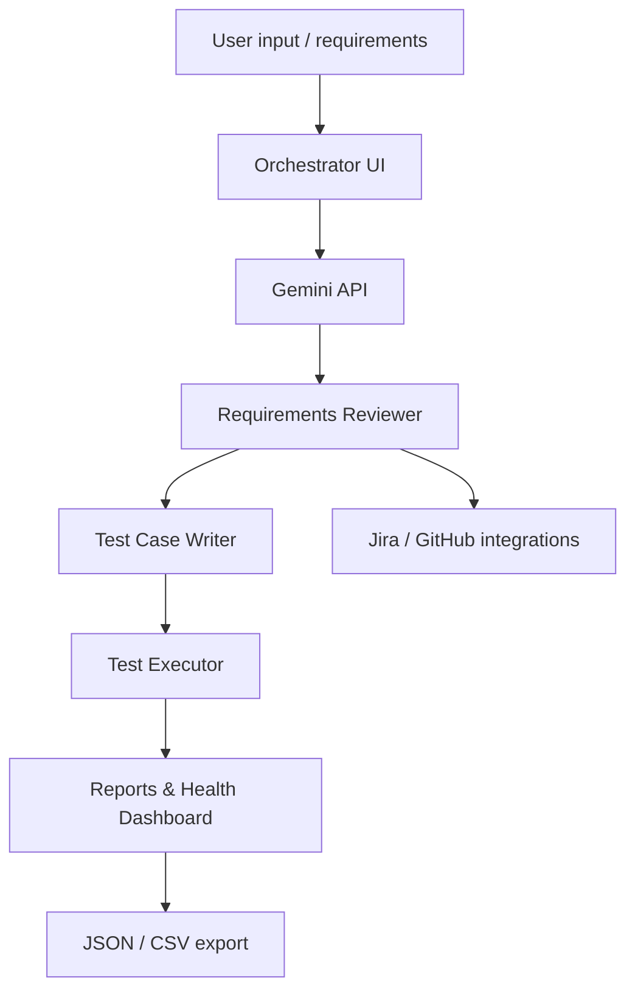

# QA Nexus Autonomous

> A high-fidelity, multi-agent AI orchestrator powered by Google Gemini that automates the end-to-end QA lifecycle—from intelligent requirements analysis and ambiguity detection to traceable test case generation and integrated execution tracking with full Jira/GitHub bidirectional synchronization.


---

## Table of Contents

- [Overview](#overview)
- [Key Features](#key-features)
- [Architecture](#architecture)
- [Prerequisites](#prerequisites)
- [Quick Start](#quick-start)
- [Usage Workflow](#usage-workflow)
- [Technology Stack](#technology-stack)
- [Testing](#testing)
- [CI/CD Pipeline](#cicd-pipeline)
- [Project Structure](#project-structure)
- [Documentation](#documentation)
- [Contributing](#contributing)
- [License](#license)

---

## Overview

QA Nexus Autonomous is a React + TypeScript application for AI-assisted quality assurance orchestration. It brings together a set of specialized agents to analyze requirements, identify ambiguities, generate test cases, and execute them with full traceability.

The system is designed to reduce manual QA overhead while preserving traceability from requirement to test and result.

### Core workflow

1. Requirements Reviewer: evaluates completeness, clarity, risk, and missing edge cases.
2. Test Case Writer: generates prioritized test scenarios with requirement traceability.
3. Test Executor: simulates execution, tracks results, and flags failures.
4. Reporting & Health Dashboard: aggregates performance, coverage, and orchestration metrics.

---

## Key Features

- Multi-agent QA orchestration with Google Gemini-powered reasoning.
- Requirement analysis and ambiguity detection for incomplete or risky specs.
- Structured test case generation with priority levels and linked requirement IDs.
- Execution simulation with pass/fail reporting and failure reasoning.
- Real-time health dashboard for metrics, latency, and token estimation.
- Jira-based requirement fetching and GitHub issue creation flow.
- JSON/CSV export utilities for reports and artifacts.
- Local persistence and session state restoration.
- Modern glassmorphism UI built with React and Vite.

---

## Architecture


```mermaid
flowchart TD
    A[User input / requirements] --> B[Orchestrator UI]
    B --> C[Gemini API]
    C --> D[Requirements Reviewer]
    D --> E[Test Case Writer]
    E --> F[Test Executor]
    F --> G[Reports & Health Dashboard]
    D --> H[Jira / GitHub integrations]
    G --> I[JSON / CSV export]
```

The app is organized around a central workflow state in `src/hooks/useWorkflow.ts`, with tabs for orchestration, agent analysis, execution, reporting, settings, and health monitoring.

---

## Prerequisites

Before running the project locally, make sure you have:

- **Node.js 24.0.0 or newer** (Node 24 LTS or later recommended)
- **npm 10 or newer**
- A Google Gemini API key from [Google AI Studio](https://aistudio.google.com)

Optional environment support:

- Supabase credentials for persistence features

### Verifying your setup

```bash
# Check Node.js version
node --version

# Check npm version
npm --version

# Both should be at or above the minimum versions
# Expected output: v24.x.x and 10.x.x respectively
```

---

## Quick Start

```bash
# Clone the repository
git clone https://github.com/darshil0/qa-nexus-autonomous.git
cd qa-nexus-autonomous

# Install dependencies
npm install

# Create your environment file
cp .env.example .env
# Add your Gemini key to .env (and optional Supabase values if needed)

# Start the app in development mode
npm run dev
```

### Environment variables

The project uses Vite environment variables. A sample file is provided at `.env.example`:

```dotenv
VITE_GEMINI_API_KEY=your_gemini_api_key_here
VITE_SUPABASE_URL=your_supabase_url_here
VITE_SUPABASE_ANON_KEY=your_supabase_anon_key_here
```

**Notes:**

- `VITE_GEMINI_API_KEY` is **required** for the AI workflow to run.
- `VITE_SUPABASE_*` values are optional and used by persistence-related features.
- Do not commit your real `.env` file (already configured in `.gitignore`).

---

## Usage Workflow

### Example input

Enter a requirement like:

> "Users should be able to reset their password using a magic link sent to their registered email address."

The system will:

- detect ambiguities and missing acceptance criteria,
- generate prioritized test cases,
- simulate execution outcomes,
- present metrics and traceability in the reports dashboard.

### Jira integration

Use the Orchestrator tab to fetch a Jira issue by ID and use that requirement as the basis for the QA workflow.

### GitHub reporting

Execution results can be used to create or prepare GitHub issue summaries for failures and follow-up work.

---

## Technology Stack

- React 19.3 — UI framework
- TypeScript 6 — type safety and application modeling
- Vite 8.3 — local dev server and build tooling
- Vitest 4.1 — unit and UI testing
- ESLint 10 — linting and code quality
- Google Gemini via `@google/genai` — AI orchestration and reasoning
- Recharts 3.10 — reporting and analytics charts
- Lucide React — iconography

---

## Testing

Run the checks used by this repository:

```bash
# Run the test suite
npm test

# Run the test suite in CI mode (single run)
npm run test -- --run

# Run coverage reporting
npm run test:coverage

# Type-check the app
npm run typecheck

# Lint the project
npm run lint

# Auto-fix linting issues
npm run lint:fix

# Build the production bundle
npm run build

# Run the full CI validation locally (recommended before submitting PRs)
npm run ci
```

### Local validation before PR submission

To validate your changes match the CI/CD pipeline, run:

```bash
npm run ci
```

This runs:
1. Linting (`npm run lint`)
2. Type checking (`npm run typecheck`)
3. Unit tests in single-run mode (`npm test -- --run`)
4. Production build (`npm run build`)

If all steps pass, your PR is ready for submission.

---

## CI/CD Pipeline

The repository uses GitHub Actions for automated validation on every push and pull request.

### Workflow triggers

- **Push to `main` or `master` branches** — full CI validation
- **Pull requests targeting `main` or `master`** — full CI validation
- **Concurrency control** — cancels previous runs for the same branch to save resources

### Pipeline stages

1. **Checkout** — Fetches repository code
2. **Node.js Setup** — Configures Node.js 24 with npm caching
3. **Dependencies** — Installs dependencies via `npm ci`
4. **Lint** — Validates code style and quality via ESLint
5. **Typecheck** — Validates TypeScript types
6. **Tests** — Runs unit and component tests via Vitest
7. **Build** — Compiles production bundle via Vite

### Troubleshooting CI failures

#### Checkout failures
If you see `fatal: cannot create directory...` errors:
- Ensure all filenames in the `docs/` directory follow valid naming conventions
- Avoid newlines or special characters in filenames
- On Windows, keep paths under 260 characters

#### Node.js version mismatches
- The pipeline uses **Node.js 24**
- Ensure your local Node.js version matches: `node --version`
- Update Node.js if needed from [nodejs.org](https://nodejs.org)

#### Dependency or cache issues
- Delete `node_modules` and `package-lock.json` locally
- Run `npm install` fresh
- The CI pipeline uses `npm ci` for reproducible installs

#### Test or build failures
- Run `npm run ci` locally to replicate the exact CI flow
- Check error messages carefully — they pinpoint the first failing step
- Ensure `.env` variables are properly configured for tests (see `.env.example`)

---

## Project Structure

```text
.
├── .github/
│   └── workflows/
│       └── ci.yml                 # GitHub Actions CI/CD pipeline
├── docs/
│   ├── ARCHITECTURE.md            # System design and component overview
│   ├── MIGRATION_GUIDE.md         # Upgrade and migration instructions
│   └── Walkthrough.md             # Step-by-step user guide
├── public/                        # Static assets
├── skills/
│   ├── gemini-knowledge-base/     # AI knowledge base skill
│   ├── requirements-reviewer/     # Requirements analysis skill
│   ├── test-case-writer/          # Test generation skill
│   └── test-executor/             # Execution simulation skill
├── src/
│   ├── assets/                    # Styles and resources
│   ├── components/
│   │   ├── common/                # Reusable UI components
│   │   ├── layout/                # Layout components (Header, Sidebar, etc.)
│   │   └── tabs/                  # Tab-based UI sections
│   ├── hooks/
│   │   └── useWorkflow.ts         # Central workflow state management
│   ├── services/
│   │   ├── agenticSkills.ts       # Agent skill orchestration
│   │   ├── geminiService.ts       # Gemini API integration
│   │   ├── mcpService.ts          # MCP tool integration
│   │   ├── memoryService.ts       # In-memory state management
│   │   └── persistenceService.ts  # Supabase persistence
│   ├── tests/                     # Unit and component tests
│   ├── types/                     # TypeScript type definitions
│   ├── utils/
│   │   ├── exportUtils.ts         # JSON/CSV export utilities
│   │   ├── logger.ts              # Logging utilities
│   │   ├── sanitizeInput.ts       # Input sanitization
│   │   └── validateEnv.ts         # Environment variable validation
│   ├── App.tsx                    # Main app component
│   └── main.tsx                   # Application entry point
├── .env.example                   # Environment variables template
├── .gitignore                     # Git ignore rules
├── AGENT.md                       # Agent architecture guide
├── CHANGELOG.md                   # Version history and release notes
├── CONTRIBUTING.md                # Contribution guidelines
├── eslint.config.js               # ESLint configuration
├── index.html                     # HTML entry point
├── LICENSE                        # MIT License
├── package.json                   # Project dependencies and scripts
├── package-lock.json              # Locked dependency versions
├── README.md                      # This file
├── Skills.MD                      # Skill registry and capabilities
├── tsconfig.json                  # TypeScript configuration
├── tsconfig.node.json             # TypeScript config for Node.js scripts
├── vite.config.ts                 # Vite build configuration
└── vitest.config.ts               # Vitest test configuration
```

---

## Documentation

- [AGENT.md](AGENT.md) — agent architecture and engineering guidance
- [Skills.MD](Skills.MD) — skill registry and capabilities overview
- [docs/ARCHITECTURE.md](docs/ARCHITECTURE.md) — system design and component overview
- [docs/Walkthrough.md](docs/Walkthrough.md) — step-by-step user experience guide
- [docs/MIGRATION_GUIDE.md](docs/MIGRATION_GUIDE.md) — upgrade and migration instructions
- [CONTRIBUTING.md](CONTRIBUTING.md) — local setup and contribution workflow
- [CHANGELOG.md](CHANGELOG.md) — version history and release notes

---

## Contributing

We welcome contributions from the community.

1. Fork the repository.
2. Create a feature branch: `git checkout -b feat/your-feature`.
3. Install dependencies: `npm install`.
4. Make your changes and add or update tests as needed.
5. **Before submitting a PR, validate locally:**
   ```bash
   npm run ci
   ```
6. Push to your fork and open a pull request against `main`.
7. Follow the repository's coding standards and keep documentation in sync.

See [CONTRIBUTING.md](CONTRIBUTING.md) for more details.

---

## License

This project is licensed under the MIT License. See the [LICENSE](LICENSE) file for details.

---

**Last Updated:** October 1, 2026  
**Version:** 3.3.0
