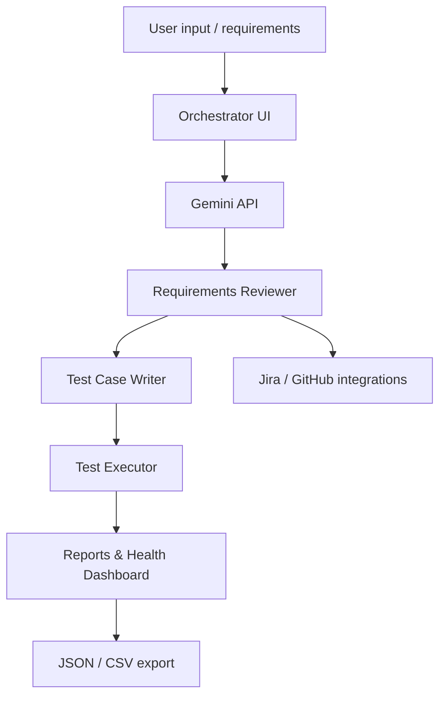

# QA Nexus Autonomous

> A high-fidelity, multi-agent AI orchestrator powered by Google Gemini that automates the end-to-end QA lifecycle—from intelligent requirements analysis and ambiguity detection to traceable test case generation, execution simulation, and integrated Jira/GitHub synchronization.


---

## Table of Contents

- [Overview](#overview)
- [Key Features](#key-features)
- [Architecture](#architecture)
- [Prerequisites](#prerequisites)
- [Quick Start](#quick-start)
- [Usage Workflow](#usage-workflow)
- [Technology Stack](#technology-stack)
- [Testing](#testing)
- [Project Structure](#project-structure)
- [Documentation](#documentation)
- [Contributing](#contributing)
- [License](#license)

---

## Overview

QA Nexus Autonomous is a React + TypeScript application for AI-assisted quality assurance orchestration. It brings together a set of specialized agents to analyze requirements, identify ambiguities, draft test cases, simulate execution, and surface actionable quality metrics.

The system is designed to reduce manual QA overhead while preserving traceability from requirement to test and result.

### Core workflow

1. Requirements Reviewer: evaluates completeness, clarity, risk, and missing edge cases.
2. Test Case Writer: generates prioritized test scenarios with requirement traceability.
3. Test Executor: simulates execution, tracks results, and flags failures.
4. Reporting & Health Dashboard: aggregates performance, coverage, and orchestration metrics.

---

## Key Features

- Multi-agent QA orchestration with Google Gemini-powered reasoning.
- Requirement analysis and ambiguity detection for incomplete or risky specs.
- Structured test case generation with priority levels and linked requirement IDs.
- Execution simulation with pass/fail reporting and failure reasoning.
- Real-time health dashboard for metrics, latency, and token estimation.
- Jira-based requirement fetching and GitHub issue creation flow.
- JSON/CSV export utilities for reports and artifacts.
- Local persistence and session state restoration.
- Modern glassmorphism UI built with React and Vite.

---

## Architecture


```mermaid
flowchart TD
    A[User input / requirements] --> B[Orchestrator UI]
    B --> C[Gemini API]
    C --> D[Requirements Reviewer]
    D --> E[Test Case Writer]
    E --> F[Test Executor]
    F --> G[Reports & Health Dashboard]
    D --> H[Jira / GitHub integrations]
    G --> I[JSON / CSV export]
```

The app is organized around a central workflow state in `src/hooks/useWorkflow.ts`, with tabs for orchestration, agent analysis, execution, reporting, settings, and health monitoring.

---

## Prerequisites

Before running the project locally, make sure you have:

- Node.js 24.0.0 or newer
- npm 10 or newer
- A Google Gemini API key from Google AI Studio

Optional environment support:

- Supabase credentials for persistence features

---

## Quick Start

```bash
# Clone the repository
git clone https://github.com/darshil0/qa-nexus-autonomous.git
cd qa-nexus-autonomous

# Install dependencies
npm install

# Create your environment file
cp .env.example .env
# Add your Gemini key to .env (and optional Supabase values if needed)

# Start the app in development mode
npm run dev
```

### Environment variables

The project uses Vite environment variables. A sample file is provided at `.env.example`:

```dotenv
VITE_GEMINI_API_KEY=your_gemini_api_key_here
VITE_SUPABASE_URL=your_supabase_url_here
VITE_SUPABASE_ANON_KEY=your_supabase_anon_key_here
```

Notes:

- `VITE_GEMINI_API_KEY` is required for the AI workflow to run.
- `VITE_SUPABASE_*` values are optional and used by persistence-related features.
- Do not commit your real `.env` file.

---

## Usage Workflow

### Example input

Enter a requirement like:

> "Users should be able to reset their password using a magic link sent to their registered email address."

The system will:

- detect ambiguities and missing acceptance criteria,
- generate prioritized test cases,
- simulate execution outcomes,
- present metrics and traceability in the reports dashboard.

### Jira integration

Use the Orchestrator tab to fetch a Jira issue by ID and use that requirement as the basis for the QA workflow.

### GitHub reporting

Execution results can be used to create or prepare GitHub issue summaries for failures and follow-up work.

---

## Technology Stack

- React 19.3 — UI framework
- TypeScript 6 — type safety and application modeling
- Vite 8.3 — local dev server and build tooling
- Vitest 4.1 — unit and UI testing
- ESLint 10 — linting and code quality
- Google Gemini via `@google/genai` — AI orchestration and reasoning
- Recharts 3.10 — reporting and analytics charts
- Lucide React — iconography

---

## Testing

Run the checks used by this repository:

```bash
# Run the test suite
npm test

# Run the test suite in CI mode
npm run test -- --run

# Run coverage reporting
npm run test:coverage

# Type-check the app
npm run typecheck

# Lint the project
npm run lint

# Build the production bundle
npm run build

# Run the full default CI flow
npm run ci
```

---

## Project Structure

```text
.
├── .github/
├── docs/
├── public/
├── skills/
├── src/
│   ├── assets/
│   ├── components/
│   ├── hooks/
│   ├── services/
│   ├── tests/
│   ├── types/
│   ├── utils/
│   ├── App.tsx
│   ├── main.tsx
│   └── ...
├── .env.example
├── AGENT.md
├── CHANGELOG.md
├── CONTRIBUTING.md
├── eslint.config.js
├── index.html
├── LICENSE
├── package.json
├── README.md
├── Skills.MD
├── tsconfig.json
├── tsconfig.node.json
├── vite.config.ts
├── vitest.config.ts
└── package-lock.json
```

---

## Documentation

- [AGENT.md](AGENT.md) — agent architecture and engineering guidance
- [Skills.MD](Skills.MD) — skill registry and capabilities overview
- [CONTRIBUTING.md](CONTRIBUTING.md) — local setup and contribution workflow
- [CHANGELOG.md](CHANGELOG.md) — version history and release notes

---

## Contributing

We welcome contributions from the community.

1. Fork the repository.
2. Create a feature branch: `git checkout -b feat/your-feature`.
3. Install dependencies: `npm install`.
4. Make your change and add or update tests as needed.
5. Run `npm run ci` before submitting a pull request.
6. Follow the repository's coding standards and keep documentation in sync.

See [CONTRIBUTING.md](CONTRIBUTING.md) for more details.

---

## License

This project is licensed under the MIT License. See the [LICENSE](LICENSE) file for details.

---

Last Updated: October 1, 2026
Version: 3.3.0
