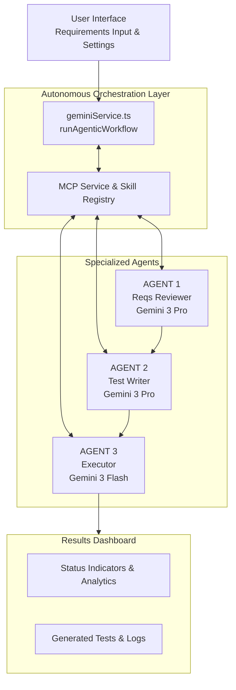

# QA Nexus Autonomous - Multi-Agent Architecture

**Version**: 2.10.0
**Last Updated**: February 17, 2026
**Status**: Production Ready

## Table of Contents

1. [Overview](#overview)
2. [Prerequisites](#prerequisites)
3. [System Architecture](#system-architecture)
4. [Model Context Protocol (MCP) & Agentic Skills](#model-context-protocol-mcp--agentic-skills)
5. [Recursive Agentic Loop](#recursive-agentic-loop)
6. [Tiny GPT Engine](#tiny-gpt-engine)
7. [Observability & Health Dashboard](#observability--health-dashboard)
8. [Persistence & Memory](#persistence--memory)
9. [Component Architecture](#component-architecture)
8. [Agent Specifications](#agent-specifications)
9. [Core Development Patterns](#core-development-patterns)
10. [Integration Points](#integration-points)
11. [Response Schemas](#response-schemas)
12. [TypeScript Type Definitions](#typescript-type-definitions)
13. [Testing & Validation](#testing--validation)
14. [Security & Production](#security--production)
15. [Deployment Guide](#deployment-guide)
16. [Troubleshooting](#troubleshooting)
17. [Best Practices](#best-practices)
18. [Contributing](#contributing)
19. [Development Roadmap](#development-roadmap)

---

## Overview

QA Nexus Autonomous is a sophisticated multi-agent system that leverages Google's Gemini AI to automate the complete Quality Assurance workflow. The system orchestrates three specialized AI agents that work sequentially to transform project requirements into executable test cases with simulated results.

### Key Capabilities

- **Intelligent Requirements Analysis**: Identifies gaps, ambiguities, and potential issues
- **Automated Test Generation**: Creates comprehensive, prioritized test cases
- **Execution Simulation**: Simulates test runs with realistic pass/fail metrics
- **Real-time Orchestration**: Manages agent workflow with live status updates
- **Error Recovery**: Graceful handling of API failures and malformed responses

### Use Cases

- Sprint planning and requirements validation
- Automated test case generation for new features
- QA process acceleration
- Requirements quality assessment
- Test coverage analysis
- Documentation generation for QA teams

---

## Prerequisites

### Required Software

```bash
# Node.js (version 18 or higher)
node --version  # Should show v18.x.x or higher

# npm (version 9 or higher)
npm --version   # Should show 9.x.x or higher

# Git (for version control)
git --version
```

### Required Accounts & API Keys

1. **Google Gemini API Key** (Required)
   - Visit [Google AI Studio](https://aistudio.google.com)
   - Create or select a project
   - Enable the Gemini API
   - Generate an API key
   - Store securely in `.env` file

2. **Supabase Account** (Optional)
   - For persistent data storage
   - Get credentials from [Supabase Dashboard](https://supabase.com)

### Installation

```bash
# Clone repository
git clone https://github.com/darshil0/qa-nexus-autonomous.git
cd qa-nexus-autonomous

# Install dependencies (use peer-deps flag for React 19 compatibility)
npm install --legacy-peer-deps

# Create environment file
cp .env.example .env  # Or create manually

# Add your API key to .env
echo "VITE_GEMINI_API_KEY=your_api_key_here" >> .env

# Start development server
npm run dev
```

---

## System Architecture

### High-Level System Flow

QA Nexus implements a sophisticated multi-agent architecture where three specialized agents work together through a centralized orchestration layer.

```mermaid
graph TD
    Input[INPUT LAYER<br/>Requirements: PRD, User Stories, Jira, Swagger]

    subgraph ORCHESTRATION [ORCHESTRATION LAYER]
        Orch[Central Orchestrator<br/>React + Hook Orchestration]
    end

    Input --> Orch

    subgraph AGENTS [AUTONOMOUS AGENTS]
        A1[AGENT 1<br/>Reqs Reviewer]
        A2[AGENT 2<br/>Test Writer]
        A3[AGENT 3<br/>Test Executor]
    end

    Orch --> A1
    A1 --> A2
    A2 --> A3

    A1 & A2 & A3 --> Memory[AGENT MEMORY & CONTEXT BUFFER<br/>Short-term session history]

    Memory --> MCP[MODEL CONTEXT PROTOCOL (MCP)<br/>Skill Registry: Jira, GitHub, Analysis]

    MCP --> Persistence[LOCAL PERSISTENCE LAYER<br/>LocalStorage Sync & Hydration]

    subgraph KNOWLEDGE [KNOWLEDGE & MEMORY LAYER]
        Vector[Vector DB]
        Relational[Relational DB]
        CtxStore[Agent Context Store]
    end

    Persistence --> Vector & Relational & CtxStore

    subgraph INTEGRATION [INTEGRATION LAYER]
        JiraGit[Jira | GitHub]
        CICD[CI/CD | TestRail]
    end

    Vector & Relational & CtxStore --> JiraGit & CICD

    style Orch fill:#6366f1,color:#fff
    style AGENTS fill:#1e293b,color:#fff,stroke:#6366f1
    style MCP fill:#f43f5e,color:#fff
```

### Workflow Steps

1. **Input**: Requirements submitted via UI or API
2. **Orchestrator**: Parses task, stores artifacts, triggers Agent 1
3. **Agent 1**: Reviews requirements → produces validated spec
4. **Agent 2**: Consumes spec → generates structured test cases
5. **Agent 3**: Executes tests → records results
6. **Feedback**: Results flow back to central store for analysis

### Core Components

#### 1. Interaction Layer
- **Web UI**: React application for user interaction
- **API Gateway**: REST endpoints for integrations
- **Orchestrator**: Central workflow controller

#### 2. Knowledge Layer
- **Vector DB**: Stores documents with semantic search
- **Relational DB**: Structured requirements, test cases, results
- **Agent Memory**: Context storage for AI agents

#### 3. Integration Layer
- **Jira/Azure DevOps**: Requirement syncing
- **GitHub/GitLab**: Issue creation, code access
- **Test Tools**: TestRail, automation frameworks
- **CI/CD**: Jenkins, GitHub Actions

### Deployment Architecture

#### Current: Modular Monolith
```
┌──────────────────────────────────────────┐
│      Single Backend Service              │
│  ┌────────────────────────────────┐      │
│  │  Orchestrator                  │      │
│  └──────┬─────────────────────────┘      │
│         │                                │
│    ┌────┴─────┬───────────┐             │
│    ▼          ▼           ▼             │
│  Agent1    Agent2      Agent3           │
│    │          │           │             │
│    └──────────┴───────────┘             │
│               │                          │
│    ┌──────────▼─────────────┐           │
│    │  Shared DB & Memory    │           │
│    └────────────────────────┘           │
└──────────────────────────────────────────┘
```

**Best for**: Small-medium teams, rapid development

#### Future: Microservices
```
┌─────────┐   ┌─────────┐   ┌─────────┐
│ Agent 1 │──▶│ Agent 2 │──▶│ Agent 3 │
│ Service │   │ Service │   │ Service │
└────┬────┘   └────┬────┘   └────┬────┘
     │             │             │
     └─────────────┴─────────────┘
                   │
            ┌──────▼──────┐
            │ Message Bus │
            └─────────────┘
```

**Best for**: Large teams, high scale, independent deployment

---

## Model Context Protocol (MCP) & Gemini Skills

QA Nexus Autonomous integrates a subset of the **Model Context Protocol (MCP)**, providing a standardized framework for agents to discover and execute external tools (Gemini Skills).

### Technical Implementation

- **Protocol**: Based on JSON-RPC 2.0.
- **Service**: Handled by `MCPService` in `src/services/mcpService.ts`.
- **Discovery**: Agents can query available capabilities using the `tools/list` method.
- **Execution**: The `tools/call` method triggers skill execution with named parameters.

### Skill Registry

The `skillRegistry` in `src/services/agenticSkills.ts` serves as the centralized library of autonomous capabilities:

| Skill Name | Description | Required Parameters |
|------------|-------------|---------------------|
| `jira_search` | Contextual requirement lookup. | `query` |
| `github_issue_create` | Automated bug reporting. | `title`, `body` |
| `test_runner` | Real-time execution simulation. | `testCaseId` |
| `code_analysis` | Deep inspection for security/logic. | `code` |
| `tiny_gpt_reference` | Technical specs of the GPT engine. | `topic` |
| `performance_audit` | Automated benchmarking/profiling. | `url` |
| `gemini_knowledge_base` | Gemini technical specs & optimization. | `topic` |

---

## Recursive Agentic Loop

The core orchestration has evolved from a linear pipeline to an iterative reasoning sequence. This is implemented via the `runAgenticWorkflow` helper in `src/services/geminiService.ts`.

### Loop Sequence

1.  **Contextual Analysis**: The agent evaluates the user prompt alongside the available MCP skill documentation.
2.  **Multi-Pass Iteration**: The system supports up to **3 sequential iterations** per request.
3.  **Thought & Action**: In each pass, the agent generates a `thought` (internal reasoning) and an optional `tool_call`.
4.  **Observation Integration**: If a tool is called, the `MCPService` executes it, and the result is appended to the next pass as an `[OBSERVATION]`.
5.  **Final Synthesis**: Once the agent has sufficient context (or reaches the iteration limit), it produces the final structured JSON artifact.

### State Management

- Conversation history is preserved across passes to maintain context.
- Recursive logic allows for complex information gathering (e.g., searching Jira for a requirement, then analyzing the related code snippet).

---

## Tiny GPT Engine

Located in `src/engine/tiny_gpt.py`, the Tiny GPT engine serves as an architectural reference for the fundamental mechanics of Large Language Models.

### Core Implementation Details

- **Dependency-Free**: Pure Python implementation using only `math`, `random`, and `os`.
- **Atomic Algorithm**: Demonstrates scalar-based Autograd, Attention heads, and Transformer blocks in under 300 lines.
- **Reference Role**: AI agents can query the logic of this engine using the `tiny_gpt_reference` MCP skill to ensure technical precision during code reviews and test generation.

---

## Observability & Health Dashboard

QA Nexus v2.7.0 introduces deep observability into the agentic reasoning process through the **Loop Health** dashboard.

### Real-time Metrics

- **Tool Call Frequency**: Visualizes which MCP skills (Jira, GitHub, etc.) are used most often.
- **Reasoning Loop Depth**: Monitors how many iterations agents need to solve complex tasks.
- **Estimated Token Consumption**: Provides a crude estimate of context window utilization to prevent saturation.
- **Latency Tracking**: Measures the end-to-end time for recursive loops, including tool execution.

### Qualitative Indicators

- **Resource Saturation**: Percentage-based gauge of prompt limit utilization.
- **Reasoning Efficiency**: Evaluates loop depth vs. successful output to detect potential "infinite thought loops."

---

## Persistence & Memory

### Local Persistence
The application uses a **Persistence Service** (`src/services/persistenceService.ts`) to manage session state.
- **LocalStorage**: Entire `WorkflowState` is serialized and saved on every state change.
- **State Hydration**: On load, the system restores requirements, results, and metrics, ensuring progress isn't lost on refresh.

### Short-term memory
The **Agent Memory Service** (`src/services/memoryService.ts`) provides agents with a rolling buffer of recent interactions.
- **Context Preservation**: Agents see their previous thoughts and tool observations from earlier pipeline stages.
- **Cross-Agent Knowledge**: Agent 3 can reference reasoning performed by Agent 1, leading to more consistent bug reports and execution logs.

---

## Component Architecture

### Big Picture: Multi-Agent Workflow



### Component Architecture

The project utilizes a modular architecture with robust path aliasing (`@/`) to ensure maintainability and clean imports.

```
src/
├── App.tsx                      # Root component (Layout & Routing)
├── main.tsx                     # Entry point (Env Validation & Mounting)
│
├── components/                  # UI components
│   ├── common/                  # Atomic units (NavBtn, StatCard)
│   ├── layout/                  # Page structure (Header, Sidebar)
│   └── tabs/                    # Specialized agentic views
│
├── hooks/
│   └── useWorkflow.ts           # Central orchestration logic
│
├── services/
│   ├── geminiService.ts        # Gemini API & Recursive Loops
│   ├── mcpService.ts           # Model Context Protocol
│   ├── agenticSkills.ts        # Autonomous Skill Registry
│   ├── persistenceService.ts   # LocalStorage management
│   └── memoryService.ts        # Short-term context buffer
│
├── types/
│   └── index.ts                # Unified TypeScript definitions
│
└── constants/
    └── index.ts                # Global configuration & Model settings
```

---

## Agent Specifications

### Agent 1: Requirements Reviewer

**Purpose**: Analyze project requirements and identify potential issues, gaps, and areas for improvement using autonomous reasoning.

#### Responsibilities

1. **Completeness Check**: Verify all necessary requirements are present.
2. **Clarity Assessment**: Identify ambiguous or unclear specifications.
3. **Consistency Validation**: Find contradictory requirements.
4. **Risk Identification**: Highlight potential implementation challenges.
5. **Autonomous Search**: Uses `jira_search` to fetch external context or verify existing tickets.
6. **Code Alignment**: Uses `code_analysis` to ensure requirements align with existing architecture.

#### Input Format

```typescript
interface ReviewInput {
  requirements: string;  // Raw requirements text from user
}
```

#### Output Format

```typescript
interface RequirementsReview {
  issues: Array<{
    severity: 'critical' | 'high' | 'medium' | 'low';
    category: string;
    description: string;
    suggestion: string;
  }>;
  completeness: {
    score: number;        // 0-100
    missingAreas: string[];
  };
  recommendations: string[];
  overallAssessment: string;
}
```

#### Prompt Strategy

```typescript
const prompt = `
You are an expert QA analyst reviewing project requirements.

REQUIREMENTS:
${requirements}

Analyze these requirements and provide a comprehensive review in JSON format:
{
  "issues": [
    {
      "severity": "critical|high|medium|low",
      "category": "Clarity|Completeness|Consistency|Security|Performance|etc",
      "description": "What the issue is",
      "suggestion": "How to fix it"
    }
  ],
  "completeness": {
    "score": 85,
    "missingAreas": ["Authentication details", "Error handling"]
  },
  "recommendations": [
    "Add input validation requirements",
    "Specify error message formats"
  ],
  "overallAssessment": "Summary of requirements quality"
}

Focus on:
- Security implications
- Edge cases and error scenarios
- Performance considerations
- User experience gaps
- Technical feasibility
`;
```

#### Example Output

```json
{
  "issues": [
    {
      "severity": "high",
      "category": "Security",
      "description": "Password strength requirements not specified",
      "suggestion": "Define minimum password requirements (length, complexity, special characters)"
    },
    {
      "severity": "medium",
      "category": "Clarity",
      "description": "Session timeout duration unclear",
      "suggestion": "Specify exact timeout period (e.g., 30 minutes of inactivity)"
    }
  ],
  "completeness": {
    "score": 75,
    "missingAreas": [
      "Password reset flow details",
      "Account lockout policy",
      "Token expiration times"
    ]
  },
  "recommendations": [
    "Add rate limiting specifications for all endpoints",
    "Define error message formats and codes",
    "Specify logging and audit requirements"
  ],
  "overallAssessment": "Requirements provide a solid foundation but need security hardening and edge case coverage."
}
```

---

### Agent 2: Test Case Writer

**Purpose**: Generate comprehensive, prioritized test cases based on requirements and review results.

#### Responsibilities

1. **Test Case Generation**: Create detailed test scenarios.
2. **Priority Assignment**: Rank tests by importance (P0, P1, P2, P3).
3. **Coverage Analysis**: Ensure all requirements are tested.
4. **Test Data Specification**: Define input data and expected outputs.
5. **Edge Case Identification**: Include boundary and negative tests.
6. **Algorithm Reference**: Uses `tiny_gpt_reference` to ensure correctness for complex logic tests.

#### Input Format

```typescript
interface TestCaseInput {
  requirements: string;
  review: RequirementsReview;  // Optional: output from Agent 1
}
```

#### Output Format

```typescript
interface TestCase {
  id: string;                    // Unique identifier (e.g., "TC001")
  title: string;                 // Short description
  priority: 'P0' | 'P1' | 'P2' | 'P3';
  category: string;              // Feature area
  type: 'functional' | 'security' | 'performance' | 'integration' | 'edge-case';
  steps: Array<{
    step: number;
    action: string;
    expectedResult: string;
  }>;
  testData: {
    inputs: Record<string, any>;
    expectedOutputs: Record<string, any>;
  };
  prerequisites: string[];       // Setup requirements
  tags: string[];                // For filtering/grouping
}
```

#### Prompt Strategy

```typescript
const prompt = `
You are an expert test engineer creating comprehensive test cases.

REQUIREMENTS:
${requirements}

REVIEW FINDINGS:
${JSON.stringify(review, null, 2)}

Generate test cases in JSON format:
{
  "testCases": [
    {
      "id": "TC001",
      "title": "User login with valid credentials",
      "priority": "P0",
      "category": "Authentication",
      "type": "functional",
      "steps": [
        {
          "step": 1,
          "action": "Navigate to login page",
          "expectedResult": "Login form is displayed"
        }
      ],
      "testData": {
        "inputs": {"email": "user@example.com", "password": "ValidPass123!"},
        "expectedOutputs": {"status": "success", "redirectTo": "/dashboard"}
      },
      "prerequisites": ["User account exists", "Database is accessible"],
      "tags": ["smoke", "regression", "authentication"]
    }
  ]
}

Coverage Requirements:
- All happy path scenarios (P0/P1)
- Security edge cases (P0/P1)
- Negative test cases (P1/P2)
- Boundary conditions (P2)
- Integration points (P1/P2)
- Performance scenarios (P2/P3)

Prioritization Guide:
- P0: Critical path, security, data integrity
- P1: Core functionality, major features
- P2: Secondary features, edge cases
- P3: Nice-to-have, minor edge cases
`;
```

#### Example Output

```json
{
  "testCases": [
    {
      "id": "TC001",
      "title": "Login with valid email and password",
      "priority": "P0",
      "category": "Authentication",
      "type": "functional",
      "steps": [
        {
          "step": 1,
          "action": "Navigate to /login",
          "expectedResult": "Login form displays with email and password fields"
        },
        {
          "step": 2,
          "action": "Enter valid email: user@example.com",
          "expectedResult": "Email field accepts input"
        },
        {
          "step": 3,
          "action": "Enter valid password: SecurePass123!",
          "expectedResult": "Password field masks characters"
        },
        {
          "step": 4,
          "action": "Click 'Login' button",
          "expectedResult": "User redirected to /dashboard with success message"
        }
      ],
      "testData": {
        "inputs": {
          "email": "user@example.com",
          "password": "SecurePass123!"
        },
        "expectedOutputs": {
          "statusCode": 200,
          "redirectUrl": "/dashboard",
          "sessionToken": "exists"
        }
      },
      "prerequisites": [
        "User account exists in database",
        "Account is not locked",
        "Database is accessible"
      ],
      "tags": ["smoke", "regression", "authentication", "critical"]
    },
    {
      "id": "TC002",
      "title": "Login with invalid password",
      "priority": "P0",
      "category": "Authentication",
      "type": "security",
      "steps": [
        {
          "step": 1,
          "action": "Navigate to /login",
          "expectedResult": "Login form displays"
        },
        {
          "step": 2,
          "action": "Enter valid email: user@example.com",
          "expectedResult": "Email field accepts input"
        },
        {
          "step": 3,
          "action": "Enter invalid password: wrongpass",
          "expectedResult": "Password field masks characters"
        },
        {
          "step": 4,
          "action": "Click 'Login' button",
          "expectedResult": "Error message: 'Invalid credentials' displayed. User remains on login page."
        }
      ],
      "testData": {
        "inputs": {
          "email": "user@example.com",
          "password": "wrongpass"
        },
        "expectedOutputs": {
          "statusCode": 401,
          "error": "Invalid credentials",
          "remainOnPage": true
        }
      },
      "prerequisites": ["User account exists"],
      "tags": ["security", "negative", "authentication"]
    }
  ]
}
```

---

### Agent 3: Test Executor

**Purpose**: Simulate test execution and provide realistic results with metrics.

#### Responsibilities

1. **Execution Simulation**: Simulate running each test case.
2. **Result Generation**: Determine pass/fail with realistic distribution.
3. **Metrics Calculation**: Compute success rate, duration, coverage.
4. **Failure Analysis**: Provide failure reasons and debugging hints.
5. **Report Generation**: Create comprehensive execution report.
6. **Automated Reporting**: Uses `github_issue_create` to autonomously log bugs for failed tests.
7. **Performance Benchmarking**: Uses `performance_audit` to include real-world latency metrics in reports.

#### Input Format

```typescript
interface ExecutionInput {
  testCases: TestCase[];
}
```

#### Output Format

```typescript
interface TestResults {
  summary: {
    total: number;
    passed: number;
    failed: number;
    skipped: number;
    successRate: number;        // Percentage
    totalDuration: number;      // Milliseconds
  };
  results: Array<{
    testCaseId: string;
    status: 'passed' | 'failed' | 'skipped';
    duration: number;           // Milliseconds
    failureReason?: string;
    stackTrace?: string;
    screenshot?: string;        // URL or base64
    logs: string[];
  }>;
  coverage: {
    requirements: number;       // Percentage of requirements covered
    codePaths: number;          // Simulated code coverage
    features: string[];         // Features tested
  };
  recommendations: string[];    // Suggested improvements
}
```

#### Prompt Strategy

```typescript
const prompt = `
You are a test automation system executing test cases.

TEST CASES:
${JSON.stringify(testCases, null, 2)}

Simulate execution and provide results in JSON format:
{
  "summary": {
    "total": 25,
    "passed": 22,
    "failed": 2,
    "skipped": 1,
    "successRate": 88.0,
    "totalDuration": 45230
  },
  "results": [
    {
      "testCaseId": "TC001",
      "status": "passed",
      "duration": 1234,
      "logs": ["Step 1 completed", "Step 2 completed"]
    },
    {
      "testCaseId": "TC002",
      "status": "failed",
      "duration": 890,
      "failureReason": "Expected status code 401, received 500",
      "stackTrace": "Error at login.test.ts:45",
      "logs": ["Step 1 completed", "Step 2 failed"]
    }
  ],
  "coverage": {
    "requirements": 95.5,
    "codePaths": 87.3,
    "features": ["Authentication", "Password Reset", "Session Management"]
  },
  "recommendations": [
    "Add tests for OAuth flow",
    "Increase timeout for API tests"
  ]
}

Simulation Rules:
- P0 tests: 95% pass rate, faster execution
- P1 tests: 90% pass rate, moderate execution
- P2/P3 tests: 85% pass rate, variable execution
- Security tests: May fail if vulnerabilities detected
- Realistic timing: 500-3000ms per test
`;
```

#### Example Output

```json
{
  "summary": {
    "total": 15,
    "passed": 13,
    "failed": 2,
    "skipped": 0,
    "successRate": 86.7,
    "totalDuration": 23450
  },
  "results": [
    {
      "testCaseId": "TC001",
      "status": "passed",
      "duration": 1234,
      "logs": [
        "Navigated to login page",
        "Entered credentials",
        "Login successful",
        "Redirected to dashboard"
      ]
    },
    {
      "testCaseId": "TC002",
      "status": "passed",
      "duration": 987,
      "logs": [
        "Attempted login with invalid password",
        "Received expected error message",
        "User remained on login page"
      ]
    },
    {
      "testCaseId": "TC005",
      "status": "failed",
      "duration": 2100,
      "failureReason": "Rate limiting not enforced after 5 failed login attempts",
      "stackTrace": "AssertionError: Expected account to be locked\n  at login.test.ts:78\n  at runTest (executor.ts:123)",
      "logs": [
        "Made 5 failed login attempts",
        "Attempted 6th login",
        "Expected: Account locked",
        "Actual: Login attempt allowed"
      ]
    }
  ],
  "coverage": {
    "requirements": 93.3,
    "codePaths": 85.7,
    "features": [
      "Email/Password Login",
      "Invalid Credentials Handling",
      "Password Masking",
      "Session Creation"
    ]
  },
  "recommendations": [
    "Implement rate limiting for failed login attempts",
    "Add tests for session timeout scenarios",
    "Consider adding 2FA test coverage"
  ]
}
```

---

## Core Development Patterns

### 1. Recursive Agent Function Pattern

All agent functions utilize the `runAgenticWorkflow` helper to support multi-step reasoning:

```typescript
// src/services/geminiService.ts

async function runAgenticWorkflow<T>(
  agentModel: string,
  instruction: string,
  input: string,
  field: string,
  schema: Record<string, unknown>
): Promise<{ data: T | null; thinking: string }> {
  // 1. Initialize multi-pass reasoning loop (max 3 iterations)
  // 2. Construct dynamic prompt with MCP skill documentation
  // 3. Intercept tool_calls and execute via MCPService
  // 4. Feed observations back into the conversation history
  // 5. Return final synthesized data and full reasoning trace
}
```

function buildReviewPrompt(requirements: string): string {
  return `
You are an expert QA analyst...
[Detailed prompt as shown above]
`;
}

function parseAiResponse<T>(response: GenerateContentResponse, field: string): Promise<{ data: T | null; thinking: string; toolCall?: any }> {
  try {
    // 1. Extract text from Gemini response (supports method or property)
    // 2. Parse JSON schema with optional 'thought' and 'tool_call' fields
    // 3. Return structured data for the orchestrator
  } catch (error) {
    // Return standardized error state
  }
}

function validateReview(review: RequirementsReview): RequirementsReview {
  // Ensure all required fields exist
  return {
    issues: review.issues || [],
    completeness: review.completeness || { score: 0, missingAreas: [] },
    recommendations: review.recommendations || [],
    overallAssessment: review.overallAssessment || 'No assessment available'
  };
}
```

### 2. State Management Pattern

```typescript
// src/App.tsx

import { useState } from 'react';
import type { WorkflowState } from './types';

function App() {
  const [state, setState] = useState<WorkflowState>({
    requirements: '',
    status: 'idle',
    agent1: { status: 'idle', result: null },
    agent2: { status: 'idle', result: null },
    agent3: { status: 'idle', result: null },
    error: null
  });

  const runWorkflow = async () => {
    try {
      // Reset state
      setState(prev => ({ 
        ...prev, 
        status: 'running',
        error: null 
      }));

      // Agent 1: Requirements Review
      setState(prev => ({ 
        ...prev, 
        agent1: { status: 'running', result: null } 
      }));
      
      const review = await reviewRequirements(state.requirements);
      
      setState(prev => ({ 
        ...prev, 
        agent1: { status: 'completed', result: review } 
      }));

      // Agent 2: Test Case Generation
      setState(prev => ({ 
        ...prev, 
        agent2: { status: 'running', result: null } 
      }));
      
      const testCases = await generateTestCases(
        state.requirements,
        review
      );
      
      setState(prev => ({ 
        ...prev, 
        agent2: { status: 'completed', result: testCases } 
      }));

      // Agent 3: Test Execution
      setState(prev => ({ 
        ...prev, 
        agent3: { status: 'running', result: null } 
      }));
      
      const results = await executeTests(testCases);
      
      setState(prev => ({ 
        ...prev, 
        agent3: { status: 'completed', result: results },
        status: 'completed'
      }));

    } catch (error) {
      setState(prev => ({
        ...prev,
        status: 'error',
        error: error instanceof Error ? error.message : 'Unknown error'
      }));
    }
  };

  return (
    <div>
      {/* UI components */}
    </div>
  );
}
```

### 3. Async Operations Pattern

```typescript
// Handle async operations with proper error boundaries

async function safeAgentCall<T>(
  agentFn: () => Promise<T>,
  fallback: T
): Promise<T> {
  try {
    return await agentFn();
  } catch (error) {
    console.error('Agent call failed:', error);
    return fallback;
  }
}

// Usage
const review = await safeAgentCall(
  () => reviewRequirements(requirements),
  {
    issues: [],
    completeness: { score: 0, missingAreas: [] },
    recommendations: [],
    overallAssessment: 'Review failed'
  }
);
```

### 4. Response Schema Validation Pattern

```typescript
import { z } from 'zod';  // Optional: Use Zod for runtime validation

const RequirementsReviewSchema = z.object({
  issues: z.array(z.object({
    severity: z.enum(['critical', 'high', 'medium', 'low']),
    category: z.string(),
    description: z.string(),
    suggestion: z.string()
  })),
  completeness: z.object({
    score: z.number().min(0).max(100),
    missingAreas: z.array(z.string())
  }),
  recommendations: z.array(z.string()),
  overallAssessment: z.string()
});

function parseAndValidateReview(text: string): RequirementsReview {
  const cleaned = text.replace(/```json\n?/g, '').replace(/```\n?/g, '');
  const parsed = JSON.parse(cleaned);
  return RequirementsReviewSchema.parse(parsed);
}
```

---

## Integration Points

### Model Context Protocol (MCP) Integration

The `MCPService` acts as a JSON-RPC 2.0 bridge between the AI agents and the local environment.

```typescript
// Example: Executing a tool via MCP
const response = await mcpService.handleRequest({
  jsonrpc: "2.0",
  method: "tools/call",
  params: {
    name: "jira_search",
    arguments: { query: "AUTH-101" }
  },
  id: Date.now()
});
```

### Gemini API Integration

```typescript
// Configuration
const API_CONFIG = {
  model: 'gemini-3-pro-preview',
  temperature: 0.7,        // Creativity level (0-1)
  maxOutputTokens: 2048,   // Response length limit
  topP: 0.95,              // Nucleus sampling
  topK: 40                 // Top-K sampling
};

// Initialize client
const genAI = new GoogleGenerativeAI(
  import.meta.env.VITE_GEMINI_API_KEY
);

// Create model instance
const model = genAI.getGenerativeModel({
  model: API_CONFIG.model,
  generationConfig: {
    temperature: API_CONFIG.temperature,
    maxOutputTokens: API_CONFIG.maxOutputTokens,
    topP: API_CONFIG.topP,
    topK: API_CONFIG.topK,
  }
});

// Make request
const result = await model.generateContent(prompt);
const response = await result.response;
const text = response.text();
```

### Error Handling

```typescript
class GeminiAPIError extends Error {
  constructor(
    message: string,
    public statusCode?: number,
    public details?: any
  ) {
    super(message);
    this.name = 'GeminiAPIError';
  }
}

async function callGeminiAPI(prompt: string): Promise<string> {
  try {
    const model = genAI.getGenerativeModel({ model: 'gemini-3-pro-preview' });
    const result = await model.generateContent(prompt);
    const response = await result.response;
    return response.text();
  } catch (error: any) {
    if (error.status === 429) {
      throw new GeminiAPIError(
        'Rate limit exceeded. Please try again later.',
        429,
        error
      );
    } else if (error.status === 401) {
      throw new GeminiAPIError(
        'Invalid API key. Check your .env file.',
        401,
        error
      );
    } else if (error.status === 500) {
      throw new GeminiAPIError(
        'Gemini API server error. Try again.',
        500,
        error
      );
    }
    throw new GeminiAPIError(
      'Unexpected error calling Gemini API',
      undefined,
      error
    );
  }
}
```

### Debugging Table

| Issue | Possible Cause | Solution |
|-------|----------------|----------|
| `API key not valid` | Missing or incorrect key in `.env` | Verify `VITE_GEMINI_API_KEY` value |
| `429 Rate Limit` | Too many requests | Implement exponential backoff |
| `Empty response` | Model returned no text | Add fallback handling |
| `JSON parse error` | Malformed JSON from model | Use try-catch with fallback |
| `Timeout` | Request took too long | Increase timeout or reduce prompt size |
| `Network error` | No internet connection | Check connectivity |
| `Type error: Cannot find module '@/types'` | Path alias not recognized | Restart TS server or check `tsconfig.json` |
| `GenAI client not initialized` | Missing `VITE_GEMINI_API_KEY` | Ensure `.env` is populated and server restarted |

---

## Response Schemas

All agent responses now include mandatory `thought` and optional `tool_call` fields to support the recursive reasoning loop.

### Complete Agent 1 Response Schema

```json
{
  "$schema": "http://json-schema.org/draft-07/schema#",
  "type": "object",
  "required": ["thought", "specs"],
  "properties": {
    "thought": {
      "type": "string"
    },
    "tool_call": {
      "type": "object",
      "properties": {
        "name": { "type": "string" },
        "arguments": { "type": "object" }
      }
    },
    "issues": {
      "type": "array",
      "items": {
        "type": "object",
        "required": ["severity", "category", "description", "suggestion"],
        "properties": {
          "severity": {
            "type": "string",
            "enum": ["critical", "high", "medium", "low"]
          },
          "category": {
            "type": "string",
            "examples": ["Security", "Performance", "Clarity", "Completeness"]
          },
          "description": {
            "type": "string"
          },
          "suggestion": {
            "type": "string"
          }
        }
      }
    },
    "completeness": {
      "type": "object",
      "required": ["score", "missingAreas"],
      "properties": {
        "score": {
          "type": "number",
          "minimum": 0,
          "maximum": 100
        },
        "missingAreas": {
          "type": "array",
          "items": {
            "type": "string"
          }
        }
      }
    },
    "recommendations": {
      "type": "array",
      "items": {
        "type": "string"
      }
    },
    "overallAssessment": {
      "type": "string"
    }
  }
}
```

### Complete Agent 2 Response Schema

```json
{
  "$schema": "http://json-schema.org/draft-07/schema#",
  "type": "object",
  "required": ["thought", "testCases"],
  "properties": {
    "thought": {
      "type": "string"
    },
    "tool_call": {
      "type": "object",
      "properties": {
        "name": { "type": "string" },
        "arguments": { "type": "object" }
      }
    },
    "testCases": {
      "type": "array",
      "items": {
        "type": "object",
        "required": ["id", "title", "priority", "category", "type", "steps"],
        "properties": {
          "id": {
            "type": "string",
            "pattern": "^TC[0-9]{3}$"
          },
          "title": {
            "type": "string"
          },
          "priority": {
            "type": "string",
            "enum": ["P0", "P1", "P2", "P3"]
          },
          "category": {
            "type": "string"
          },
          "type": {
            "type": "string",
            "enum": ["functional", "security", "performance", "integration", "edge-case"]
          },
          "steps": {
            "type": "array",
            "items": {
              "type": "object",
              "required": ["step", "action", "expectedResult"],
              "properties": {
                "step": {
                  "type": "number"
                },
                "action": {
                  "type": "string"
                },
                "expectedResult": {
                  "type": "string"
                }
              }
            }
          },
          "testData": {
            "type": "object",
            "properties": {
              "inputs": {
                "type": "object"
              },
              "expectedOutputs": {
                "type": "object"
              }
            }
          },
          "prerequisites": {
            "type": "array",
            "items": {
              "type": "string"
            }
          },
          "tags": {
            "type": "array",
            "items": {
              "type": "string"
            }
          }
        }
      }
    }
  }
}
```

### Complete Agent 3 Response Schema

```json
{
  "$schema": "http://json-schema.org/draft-07/schema#",
  "type": "object",
  "required": ["thought", "results"],
  "properties": {
    "thought": {
      "type": "string"
    },
    "tool_call": {
      "type": "object",
      "properties": {
        "name": { "type": "string" },
        "arguments": { "type": "object" }
      }
    },
    "summary": {
      "type": "object",
      "required": ["total", "passed", "failed", "skipped", "successRate", "totalDuration"],
      "properties": {
        "total": {
          "type": "number"
        },
        "passed": {
          "type": "number"
        },
        "failed": {
          "type": "number"
        },
        "skipped": {
          "type": "number"
        },
        "successRate": {
          "type": "number",
          "minimum": 0,
          "maximum": 100
        },
        "totalDuration": {
          "type": "number"
        }
      }
    },
    "results": {
      "type": "array",
      "items": {
        "type": "object",
        "required": ["testCaseId", "status", "duration"],
        "properties": {
          "testCaseId": {
            "type": "string"
          },
          "status": {
            "type": "string",
            "enum": ["passed", "failed", "skipped"]
          },
          "duration": {
            "type": "number"
          },
          "failureReason": {
            "type": "string"
          },
          "stackTrace": {
            "type": "string"
          },
          "logs": {
            "type": "array",
            "items": {
              "type": "string"
            }
          }
        }
      }
    },
    "coverage": {
      "type": "object",
      "required": ["requirements", "codePaths", "features"],
      "properties": {
        "requirements": {
          "type": "number",
          "minimum": 0,
          "maximum": 100
        },
        "codePaths": {
          "type": "number",
          "minimum": 0,
          "maximum": 100
        },
        "features": {
          "type": "array",
          "items": {
            "type": "string"
          }
        }
      }
    },
    "recommendations": {
      "type": "array",
      "items": {
        "type": "string"
      }
    }
  }
}
```

---

## TypeScript Type Definitions

```typescript
// src/types.ts

// Workflow State
export interface WorkflowState {
  status: WorkflowStatus;
  rawRequirements: string;
  validatedSpecs: ValidatedSpec[];
  testCases: TestCase[];
  results: ExecutionResult[];
  error?: string;
  thinkingProcess: string;
  settings: AISettings;
  metrics: OrchestrationMetrics;
}

// Generic Agent State
export interface AgentState<T> {
  status: 'idle' | 'running' | 'completed' | 'error';
  result: T | null;
  error?: string;
}

// Agent 1: Requirements Review
export interface RequirementsReview {
  issues: Issue[];
  completeness: Completeness;
  recommendations: string[];
  overallAssessment: string;
}

export interface Issue {
  severity: 'critical' | 'high' | 'medium' | 'low';
  category: string;
  description: string;
  suggestion: string;
}

export interface Completeness {
  score: number;
  missingAreas: string[];
}

// Agent 2: Test Cases
export interface TestCaseCollection {
  testCases: TestCase[];
}

export interface TestCase {
  id: string;
  title: string;
  priority: 'P0' | 'P1' | 'P2' | 'P3';
  category: string;
  type: 'functional' | 'security' | 'performance' | 'integration' | 'edge-case';
  steps: TestStep[];
  testData: TestData;
  prerequisites: string[];
  tags: string[];
}

export interface TestStep {
  step: number;
  action: string;
  expectedResult: string;
}

export interface TestData {
  inputs: Record<string, any>;
  expectedOutputs: Record<string, any>;
}

// Agent 3: Test Results
export interface TestResults {
  summary: TestSummary;
  results: TestResult[];
  coverage: Coverage;
  recommendations: string[];
}

export interface TestSummary {
  total: number;
  passed: number;
  failed: number;
  skipped: number;
  successRate: number;
  totalDuration: number;
}

export interface TestResult {
  testCaseId: string;
  status: 'passed' | 'failed' | 'skipped';
  duration: number;
  failureReason?: string;
  stackTrace?: string;
  screenshot?: string;
  logs: string[];
}

export interface Coverage {
  requirements: number;
  codePaths: number;
  features: string[];
}

// Utility Types
export type AgentFunction<TInput, TOutput> = (
  input: TInput
) => Promise<TOutput>;

export type AgentStatus = 'idle' | 'running' | 'completed' | 'error';
```

---

## Testing & Validation

### Unit Tests

```typescript
// src/__tests__/geminiService.spec.ts

import { describe, it, expect, beforeEach } from 'vitest';
import { reviewRequirements, generateTestCases, executeTests } from '../services/geminiService';

describe('geminiService', () => {
  describe('reviewRequirements', () => {
    it('should return valid review for simple requirements', async () => {
      const requirements = 'Build a login page with email and password';
      const review = await reviewRequirements(requirements);
      
      expect(review).toHaveProperty('issues');
      expect(review).toHaveProperty('completeness');
      expect(review).toHaveProperty('recommendations');
      expect(Array.isArray(review.issues)).toBe(true);
    });

    it('should handle empty requirements gracefully', async () => {
      const review = await reviewRequirements('');
      
      expect(review).toBeDefined();
      expect(review.issues).toBeDefined();
    });

    it('should identify security issues', async () => {
      const requirements = 'Allow users to upload files';
      const review = await reviewRequirements(requirements);
      
      const securityIssues = review.issues.filter(
        issue => issue.category.toLowerCase().includes('security')
      );
      
      expect(securityIssues.length).toBeGreaterThan(0);
    });
  });

  describe('generateTestCases', () => {
    it('should generate test cases from requirements', async () => {
      const requirements = 'Login with email and password';
      const review = await reviewRequirements(requirements);
      const testCases = await generateTestCases(requirements, review);
      
      expect(testCases.testCases).toBeDefined();
      expect(Array.isArray(testCases.testCases)).toBe(true);
      expect(testCases.testCases.length).toBeGreaterThan(0);
    });

    it('should prioritize critical tests as P0', async () => {
      const requirements = 'User authentication system';
      const review = await reviewRequirements(requirements);
      const testCases = await generateTestCases(requirements, review);
      
      const p0Tests = testCases.testCases.filter(tc => tc.priority === 'P0');
      expect(p0Tests.length).toBeGreaterThan(0);
    });
  });

  describe('executeTests', () => {
    it('should simulate test execution', async () => {
      const mockTestCases = {
        testCases: [
          {
            id: 'TC001',
            title: 'Test login',
            priority: 'P0' as const,
            category: 'Auth',
            type: 'functional' as const,
            steps: [],
            testData: { inputs: {}, expectedOutputs: {} },
            prerequisites: [],
            tags: []
          }
        ]
      };
      
      const results = await executeTests(mockTestCases);
      
      expect(results.summary).toBeDefined();
      expect(results.summary.total).toBe(1);
      expect(results.results).toHaveLength(1);
    });
  });
});
```

### Integration Tests

```typescript
// src/__tests__/workflow.integration.spec.ts

import { describe, it, expect } from 'vitest';
import { reviewRequirements, generateTestCases, executeTests } from '../services/geminiService';

describe('Full Workflow Integration', () => {
  it('should complete end-to-end workflow', async () => {
    // Step 1: Review requirements
    const requirements = `
      Build a user authentication system with:
      - Email/password login
      - Password reset
      - Session management
    `;
    
    const review = await reviewRequirements(requirements);
    expect(review).toBeDefined();
    
    // Step 2: Generate test cases
    const testCases = await generateTestCases(requirements, review);
    expect(testCases.testCases.length).toBeGreaterThan(0);
    
    // Step 3: Execute tests
    const results = await executeTests(testCases);
    expect(results.summary.total).toBe(testCases.testCases.length);
    expect(results.summary.successRate).toBeGreaterThan(0);
  }, 60000); // 60 second timeout for API calls
});
```

### Parsing Variation Tests

```typescript
// src/__tests__/geminiService.parse.spec.ts

import { describe, it, expect } from 'vitest';
import { parseReviewResponse } from '../services/geminiService';

describe('Response Parsing', () => {
  it('should parse valid JSON response', () => {
    const response = JSON.stringify({
      issues: [],
      completeness: { score: 80, missingAreas: [] },
      recommendations: [],
      overallAssessment: 'Good'
    });
    
    const parsed = parseReviewResponse(response);
    expect(parsed).toBeDefined();
  });

  it('should handle JSON wrapped in markdown', () => {
    const response = '```json\n{"issues":[]}\n```';
    const parsed = parseReviewResponse(response);
    expect(parsed).toBeDefined();
  });

  it('should return fallback for invalid JSON', () => {
    const response = 'This is not JSON';
    const parsed = parseReviewResponse(response);
    
    expect(parsed.issues).toEqual([]);
    expect(parsed.completeness.score).toBeDefined();
  });

  it('should handle empty response', () => {
    const parsed = parseReviewResponse('');
    expect(parsed).toBeDefined();
    expect(parsed.issues).toEqual([]);
  });
});
```

---

## Security & Production

### Environment Variables

```env
# .env file (DO NOT COMMIT)

# Required
VITE_GEMINI_API_KEY=your_api_key_here

# Optional
VITE_SUPABASE_URL=https://your-project.supabase.co
VITE_SUPABASE_ANON_KEY=your_anon_key

# Development
VITE_LOG_LEVEL=debug
VITE_ENABLE_MOCK_MODE=false
```

### API Key Security

```typescript
// Validate API key on startup
if (!import.meta.env.VITE_GEMINI_API_KEY) {
  throw new Error(
    'VITE_GEMINI_API_KEY is required. Add it to your .env file.'
  );
}

// Don't log API keys
const sanitizedEnv = {
  ...import.meta.env,
  VITE_GEMINI_API_KEY: import.meta.env.VITE_GEMINI_API_KEY 
    ? '***REDACTED***' 
    : undefined
};
console.log('Environment:', sanitizedEnv);
```

### Rate Limiting

```typescript
class RateLimiter {
  private requests: number[] = [];
  private maxRequests: number;
  private timeWindow: number;

  constructor(maxRequests: number = 60, timeWindow: number = 60000) {
    this.maxRequests = maxRequests;
    this.timeWindow = timeWindow;
  }

  async acquire(): Promise<void> {
    const now = Date.now();
    this.requests = this.requests.filter(
      time => now - time < this.timeWindow
    );

    if (this.requests.length >= this.maxRequests) {
      const oldestRequest = this.requests[0];
      const waitTime = this.timeWindow - (now - oldestRequest);
      await new Promise(resolve => setTimeout(resolve, waitTime));
      return this.acquire();
    }

    this.requests.push(now);
  }
}

const rateLimiter = new RateLimiter(60, 60000); // 60 requests per minute

async function callGeminiWithRateLimit(prompt: string) {
  await rateLimiter.acquire();
  return callGeminiAPI(prompt);
}
```

### Production Checklist

- [ ] API keys stored in environment variables
- [ ] Error logging configured (e.g., Sentry)
- [ ] Rate limiting implemented
- [ ] Timeout handling for API calls
- [ ] Fallback responses for API failures
- [ ] CORS configured properly
- [ ] HTTPS enforced in production
- [ ] Build optimization enabled (`npm run build`)
- [ ] Environment variables validated on startup
- [ ] Monitoring and alerting set up

---

## Deployment Guide

### Build for Production

```bash
# Install dependencies
npm install

# Run type check
npm run typecheck

# Run tests
npm test

# Build production bundle
npm run build

# Preview production build
npm run preview
```

### Deploy to Vercel

```bash
# Install Vercel CLI
npm install -g vercel

# Deploy
vercel

# Set environment variables
vercel env add VITE_GEMINI_API_KEY
```

### Deploy to Netlify

```bash
# Install Netlify CLI
npm install -g netlify-cli

# Build
npm run build

# Deploy
netlify deploy --prod --dir=dist

# Set environment variables in Netlify dashboard
```

### Docker Deployment

```dockerfile
# Dockerfile
FROM node:18-alpine

WORKDIR /app

COPY package*.json ./
RUN npm install

COPY . .
RUN npm run build

EXPOSE 3000

CMD ["npm", "run", "preview"]
```

```bash
# Build image
docker build -t qa-nexus .

# Run container
docker run -p 3000:3000 \
  -e VITE_GEMINI_API_KEY=your_key \
  qa-nexus
```

---

## Troubleshooting

### Common Issues

| Issue | Cause | Solution |
|-------|-------|----------|
| "API key not valid" | Missing or incorrect API key | Check `.env` file has correct `VITE_GEMINI_API_KEY` |
| Empty agent results | API returned no text | Check network, verify API quota |
| JSON parse errors | Malformed response from AI | Review prompt, add better error handling |
| Slow response times | Large prompts or high latency | Reduce prompt size, check network |
| TypeScript errors | Missing type definitions | Run `npm install`, restart TS server |
| Build fails | Config file naming issues | Ensure all config files use dots (`.`) not underscores (`_`) |

### Debug Mode

```typescript
// Enable debug logging
const DEBUG = import.meta.env.VITE_LOG_LEVEL === 'debug';

function debugLog(message: string, data?: any) {
  if (DEBUG) {
    console.log(`[DEBUG] ${message}`, data);
  }
}

// Usage
debugLog('Calling Gemini API', { prompt: prompt.substring(0, 100) });
```

### API Response Debugging

```typescript
async function debugAgentCall(agentFn: () => Promise<any>, agentName: string) {
  console.log(`[${agentName}] Starting...`);
  const startTime = Date.now();
  
  try {
    const result = await agentFn();
    const duration = Date.now() - startTime;
    console.log(`[${agentName}] Completed in ${duration}ms`);
    console.log(`[${agentName}] Result:`, result);
    return result;
  } catch (error) {
    console.error(`[${agentName}] Failed:`, error);
    throw error;
  }
}
```

---

## Best Practices

### DO's ✅

1. **Validate all inputs** before sending to Gemini API
2. **Use TypeScript strict mode** for type safety
3. **Implement proper error handling** with fallbacks
4. **Cache API responses** when possible to reduce costs
5. **Log errors** but never log API keys
6. **Test edge cases** including empty inputs and malformed responses
7. **Use semantic versioning** for releases
8. **Document all agent prompts** and expected outputs
9. **Implement rate limiting** to avoid quota issues
10. **Monitor API usage** and set up alerts
11. **Sanitize all user inputs** to prevent prompt injection
12. **Use Error Boundaries** to prevent application-wide crashes
13. **Validate Environment Variables** at application startup

### DON'Ts ❌

1. **Don't commit `.env` file** to version control (CRITICAL)
2. **Don't trust AI responses** without validation
3. **Don't expose API keys** in client-side code
4. **Don't skip error handling** for API calls
5. **Don't use `any` type** (Enforced by ESLint)
6. **Don't ignore TypeScript errors**
7. **Don't deploy** without running tests
8. **Don't hardcode** configuration values
9. **Don't log sensitive data**
10. **Don't skip code reviews** for agent prompt changes

---

## Contributing

### Development Workflow

1. **Fork the repository**
2. **Create feature branch**: `git checkout -b feature/my-feature`
3. **Make changes** with clear, atomic commits
4. **Write tests** for new functionality
5. **Run linting**: `npm run lint:fix`
6. **Run tests**: `npm test`
7. **Type check**: `npm run typecheck`
8. **Push changes**: `git push origin feature/my-feature`
9. **Open Pull Request** with description

### Commit Message Format

```
type(scope): subject

body

footer
```

**Types:**
- `feat`: New feature
- `fix`: Bug fix
- `docs`: Documentation changes
- `style`: Code style changes (formatting)
- `refactor`: Code refactoring
- `test`: Adding or updating tests
- `chore`: Build process or auxiliary tool changes

**Examples:**
```
feat(agent1): add security issue detection
fix(gemini): handle empty API responses gracefully
docs(readme): update installation instructions
test(workflow): add integration test for full workflow
```

### Code Review Checklist

- [ ] Code follows TypeScript best practices
- [ ] All tests pass (`npm run ci`)
- [ ] ESLint passes without warnings
- [ ] Types are properly defined (no `any`)
- [ ] Error handling is implemented
- [ ] Documentation is updated
- [ ] Commit messages are clear and descriptive
- [ ] No sensitive data in code or comments

---

## Key Takeaways

### Agent Design Principles

1. **Single Responsibility**: Each agent has one clear purpose
2. **Sequential Execution**: Agents run in order, passing data forward
3. **Graceful Degradation**: Failures don't crash the entire workflow
4. **Stateless Agents**: No persistent state between invocations
5. **Prompt Engineering**: Clear, structured prompts yield better results

### Production Considerations

1. **Cost Management**: Monitor API usage to control costs
2. **Performance**: Optimize prompts for faster responses
3. **Reliability**: Implement retries and fallbacks
4. **Security**: Protect API keys and sanitize inputs
5. **Monitoring**: Track success rates and error patterns

### Scaling Strategies

1. **Caching**: Cache common responses to reduce API calls
2. **Batch Processing**: Process multiple requirements in parallel
3. **Queue System**: Use message queues for high volume
4. **Model Selection**: Use appropriate models for each task
5. **Result Storage**: Store results in database for history

---

**Version**: 2.9.0
**Last Updated**: February 16, 2026
**Maintained by**: QA Nexus Team

For questions or issues, please open a GitHub issue or contact the maintainers.

---

## Development Roadmap

### Phase 1: Security & Stability (Completed v2.6.0)
- ✅ Implemented `ErrorBoundary` component.
- ✅ Added input sanitization via `sanitizeRequirements`.
- ✅ Implemented startup environment validation.
- ✅ Improved error handling in async workflow functions.

### Phase 2: Orchestration & Observability (Completed v2.7.0)
- ✅ Recursive reasoning loops (Thought-Action-Observation).
- ✅ MCP-compliant tool discovery and execution.
- ✅ Real-time Health Dashboard and Metrics tracking.
- ✅ Local Session Persistence and Agent Memory.

### Phase 2: Code Quality (Ongoing)
- [ ] Achieve 100% type safety in `geminiService.ts`.
- [ ] Implement empty state handling for all UI components.
- [ ] Expand centralized `logger` usage across entire codebase.

### Phase 3: Testing & Documentation
- [ ] Add Playwright/Cypress E2E test suite.
- [ ] Increase unit test coverage for MCP and Agentic loops.
- [ ] Generate OpenAPI documentation for the internal service layer.

### Phase 4: Performance & Optimization
- [ ] Implement advanced rate limiting with token bucket algorithm.
- [ ] Optimize production bundle size via tree-shaking and lazy loading.
- [ ] Add performance monitoring for AI response latency.
