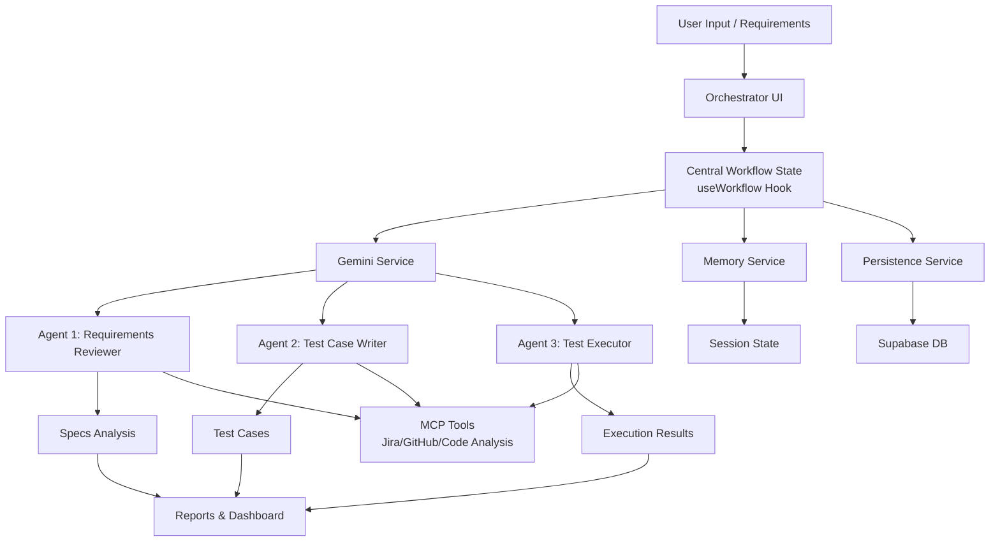

# System Architecture

**Version**: 3.3.0  
**Last Updated**: October 1, 2026

This document describes the high-level architecture, component structure, and data flow of QA Nexus Autonomous.

---

## Overview

QA Nexus Autonomous is a multi-agent AI orchestration system built with React + TypeScript. It leverages Google Gemini 2.5 to automate the end-to-end QA lifecycle through specialized agents that:

1. **Analyze requirements** for clarity, completeness, and risks
2. **Generate test cases** with priority levels and traceability
3. **Execute tests** with realistic simulations and failure tracking
4. **Report results** with metrics and health dashboards

---

## Architecture Diagram


```mermaid
flowchart TD
    A["User Input / Requirements"] --> B["Orchestrator UI"]
    B --> C["Central Workflow State<br/>useWorkflow Hook"]
    C --> D["Gemini Service"]
    D --> E["Agent 1: Requirements Reviewer"]
    D --> F["Agent 2: Test Case Writer"]
    D --> G["Agent 3: Test Executor"]
    E --> H["Specs Analysis"]
    F --> I["Test Cases"]
    G --> J["Execution Results"]
    H --> K["Reports & Dashboard"]
    I --> K
    J --> K
    C --> L["Memory Service"]
    C --> M["Persistence Service"]
    L --> N["Session State"]
    M --> O["Supabase DB"]
    E --> P["MCP Tools<br/>Jira/GitHub/Code Analysis"]
    F --> P
    G --> P
```

---

## Component Structure

### Top-Level Directories

```
qa-nexus-autonomous/
├── .github/workflows/           # GitHub Actions CI/CD
├── docs/                        # Documentation (this directory)
├── public/                      # Static assets
├── skills/                      # AI agent skill definitions
│   ├── requirements-reviewer/
│   ├── test-case-writer/
│   ├── test-executor/
│   └── gemini-knowledge-base/
├── src/
│   ├── components/              # React UI components
│   ├── hooks/                   # Custom React hooks
│   ├── services/                # Business logic & APIs
│   ├── types/                   # TypeScript definitions
│   ├── utils/                   # Utility functions
│   ├── tests/                   # Unit & component tests
│   ├── assets/                  # Styles & resources
│   ├── App.tsx                  # Main app component
│   └── main.tsx                 # Entry point
├── package.json                 # Dependencies & scripts
├── tsconfig.json                # TypeScript config
├── vite.config.ts               # Build config
├── vitest.config.ts             # Test config
├── eslint.config.js             # Linting rules
└── README.md                    # User guide
```

---

## Core Modules

### 1. **Workflow State Management** (`src/hooks/useWorkflow.ts`)

Central hook that manages the entire application state:

```typescript
interface WorkflowState {
  // Input & orchestration
  requirementInput: string;
  jiraIssueKey: string;
  workflowStatus: 'IDLE' | 'RUNNING' | 'COMPLETED' | 'FAILED';
  
  // Agent outputs
  specs: RequirementAnalysis;
  testCases: TestCase[];
  executionResults: ExecutionResult[];
  
  // UI & settings
  currentTab: TabName;
  settings: AISettings;
  thinkingLog: ThinkingLogEntry[];
  
  // Persistence
  sessionId: string;
  savedSessions: Session[];
}
```

Provides actions for:
- Starting workflows
- Updating agent outputs
- Switching tabs
- Managing settings
- Persisting/restoring sessions

### 2. **Services Layer** (`src/services/`)

#### `geminiService.ts`
- Initializes Google Gemini client
- Sends prompts to Gemini models
- Parses structured JSON responses
- Handles token counting and model selection

#### `agenticSkills.ts`
- Defines agent capabilities and system prompts
- Orchestrates multi-step agent workflows
- Manages tool calls (Jira, GitHub, code analysis)
- Formats agent outputs for UI

#### `mcpService.ts`
- Model Context Protocol implementation
- Provides tools to agents: Jira API, GitHub API, code search
- Handles tool invocation and result formatting

#### `memoryService.ts`
- In-memory session state management
- Stores workflow history and agent outputs
- Enables undo/redo functionality

#### `persistenceService.ts`
- Supabase integration for data persistence
- Saves/loads complete workflow sessions
- Implements session sync

### 3. **UI Components** (`src/components/`)

#### Layout Components
- **Header**: Branding, version, status indicator
- **Sidebar**: Tab navigation, reset button, session switcher
- **AgentThinkingLog**: Real-time display of agent reasoning

#### Tab Components
- **OrchestratorTab**: Requirement input, workflow launch
- **Agent1Tab**: Requirements analysis & ambiguity detection
- **Agent2Tab**: Test case review & search
- **Agent3Tab**: Execution results & logs
- **ReportsTab**: Charts, metrics, health dashboard
- **SettingsTab**: Model selection, temperature, reasoning iterations
- **HealthDashboardTab**: Resource saturation, token usage

#### Common Components
- **StatCard**: Metric display card
- **NavBtn**: Tab navigation button
- **ErrorBoundary**: Error handling wrapper

### 4. **Types System** (`src/types/index.ts`)

Core TypeScript interfaces:

```typescript
interface RequirementAnalysis {
  id: string;
  requirements: Requirement[];
  ambiguities: Ambiguity[];
  riskAssessment: RiskLevel;
  summary: string;
}

interface TestCase {
  id: string;
  title: string;
  priority: Priority; // P0-P3
  steps: TestStep[];
  expectedResult: string;
  linkedRequirementIds: string[];
}

interface ExecutionResult {
  testCaseId: string;
  status: 'PASS' | 'FAIL' | 'SKIP';
  duration: number;
  logs: string[];
  failureReason?: string;
}

interface AISettings {
  modelType: 'pro' | 'flash';
  temperature: number;
  reasoningIterations: number;
  maxTokens: number;
}
```

---

## Data Flow

### 1. Requirement Ingestion
```
User Input (Text/Jira)
    ↓
Workflow State (requirementInput)
    ↓
Agent 1: Requirements Reviewer
    ↓
Gemini API (with system prompt + tools)
    ↓
Structured JSON Response
    ↓
Update State (specs)
    ↓
Render Agent1Tab
```

### 2. Test Case Generation
```
Specs (from Agent 1)
    ↓
Agent 2: Test Case Writer
    ↓
Gemini API (multi-turn conversation)
    ↓
Structured JSON: TestCase[]
    ↓
Update State (testCases)
    ↓
Render Agent2Tab (searchable, filterable)
```

### 3. Execution Simulation
```
Test Cases (from Agent 2)
    ↓
Agent 3: Test Executor
    ↓
Gemini API (realistic failure scenarios)
    ↓
Structured JSON: ExecutionResult[]
    ↓
Update State (executionResults)
    ↓
Render Agent3Tab + ReportsTab
```

### 4. Persistence
```
Workflow State
    ↓
Memory Service (in-memory snapshot)
    ↓
Persistence Service
    ↓
Supabase (if enabled)
    ↓
Session Retrieval (on app reload)
```

---

## Key Design Patterns

### 1. **Centralized State Management**
- Single `useWorkflow` hook as source of truth
- All components read/write through this hook
- Enables easy undo/redo and session persistence

### 2. **Service Abstraction**
- Business logic isolated in services
- Components only call service methods
- Easy to swap implementations (e.g., different API providers)

### 3. **Structured Outputs**
- All Gemini responses validated as JSON
- TypeScript interfaces enforce shape contracts
- Reduces parsing errors and debugging time

### 4. **Tab-Based UI**
- Each agent has dedicated tab
- Workflow progresses through tabs
- Users can navigate back to review previous outputs

### 5. **Error Boundary Pattern**
- Global error handling component
- Prevents full app crashes
- Graceful degradation

---

## Agent Skills

Each agent is a specialized skill with:
- **System prompt**: Defines role, constraints, output format
- **Tools**: Jira, GitHub, code search, knowledge base
- **Input**: Requirements, previous agent outputs
- **Output**: Structured JSON with specific schema

See `/skills` directory for detailed skill documentation.

---

## Environment & Configuration

### Node.js & npm
- **Minimum**: Node 20.0.0, npm 10
- **Recommended**: Node 20 LTS

### Environment Variables
```bash
VITE_GEMINI_API_KEY=sk-...          # Required
VITE_SUPABASE_URL=https://...       # Optional
VITE_SUPABASE_ANON_KEY=eyJ...       # Optional
```

### Build Configuration
- **Bundler**: Vite
- **Test Framework**: Vitest
- **Linter**: ESLint 10 with TypeScript plugin
- **Package Manager**: npm (lockfile: package-lock.json)

---

## Performance Considerations

### Token Optimization
- Agents minimize prompt tokens with structured instructions
- Reuse context from previous agent outputs
- Settings tab lets users trade off accuracy vs. cost

### Caching
- Test case results cached in memory
- Session state persisted to avoid re-running workflows
- Supabase queries indexed on session_id

### Concurrency
- GitHub Actions uses concurrency control (cancel-in-progress)
- UI runs Gemini calls async, never blocks UI thread
- Memory service provides instant state access

---

## Security

### Secrets Management
- API keys stored in `.env` (never committed)
- `.env` is in `.gitignore`
- Environment variables injected at build/runtime

### Input Sanitization
- User requirement input sanitized before sending to Gemini
- Tool outputs validated as JSON
- HTML escaping on all rendered user input

### GitHub Actions
- Read-only permissions for checkout
- No secrets exposed in logs
- Workflows only triggered on main/master branches

---

## Testing Strategy

### Unit Tests (`src/tests/`)
- Service functions tested in isolation
- Mock Gemini API responses
- Validate data transformations

### Component Tests
- React component rendering tested
- User interactions simulated
- Props validation

### Integration Tests
- Full workflow execution tested
- Gemini integration tested (with fixtures)
- Session persistence tested

Run tests:
```bash
npm test                  # Watch mode
npm test -- --run         # Single run (CI mode)
npm run test:coverage     # Coverage report
```

---

## Future Extensibility

### Add New Agent
1. Create skill definition in `skills/new-agent/SKILL.md`
2. Implement agent logic in `agenticSkills.ts`
3. Add new tab component in `src/components/tabs/`
4. Update `WorkflowState` interface
5. Add routing in `App.tsx`

### Switch AI Provider
1. Create new service (e.g., `openaiService.ts`)
2. Implement same interface as `geminiService.ts`
3. Update `App.tsx` to inject new provider
4. Tests automatically cover new implementation

### Add Persistence Backend
1. Implement `persistenceService.ts` methods for new backend
2. Update environment variables
3. No changes needed to workflow or UI logic

---

## Troubleshooting

**CI/CD Checkout Failure**
- Ensure no files have newlines in filenames
- Check `.gitignore` for unintended exclusions
- Rebuild git tree if corruption detected

**Gemini API Errors**
- Validate API key in `.env`
- Check token limits in settings
- Review agent prompt in `agenticSkills.ts`

**Memory/Performance Issues**
- Reduce reasoning iterations
- Shorten requirement input
- Switch to Flash model (faster, cheaper)

---

For more details, see:
- [README.md](../README.md) — User guide & quick start
- [AGENT.md](../AGENT.md) — Agent engineering details
- [Skills.MD](../Skills.MD) — Skill registry
- [Contributing Guide](../CONTRIBUTING.md) — Dev setup
